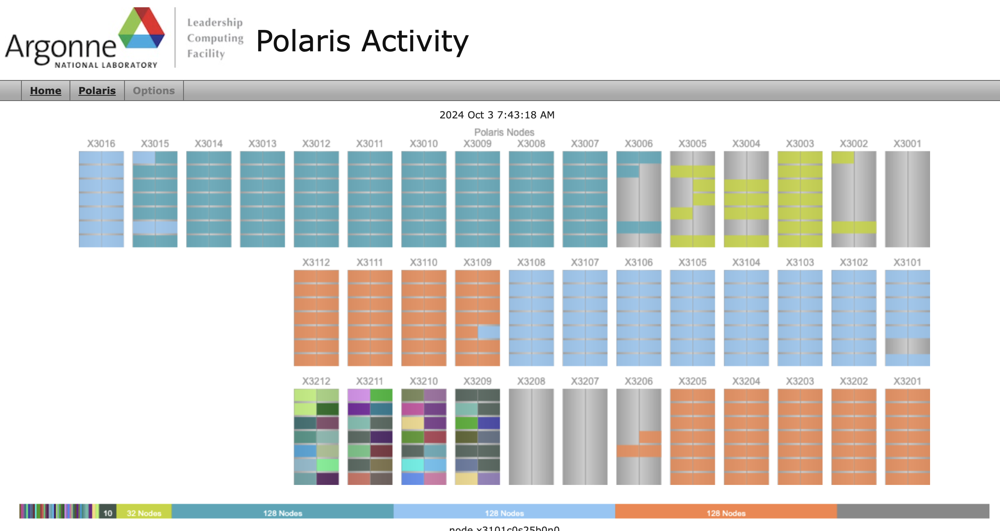

# Shared Resources
Supercomputers contain many computer _nodes_ and not every application will use ALL of them. Therefore, we use programs called _schedulers_ that allow users to schedule a _job_ based on how many nodes they need for a specified time.

A _job_ is defined by a user and requires these parameters to be definded:
* run-time: How long will this _job_ run? 5 minutes? 60 minutes? 6 hours?
* number of nodes: How many compute _nodes_ does the application need to run? 5 nodes? 100 nodes? 1000 nodes?

## [Polaris Activity Webpage](https://status.alcf.anl.gov/#/polaris)

We have a page that shows all the current activity on Polaris. The top of the page shows a graphical representation of all nodes. Colors indicate a _job_ running on that _node_. Below the graphic there is a table that lists _running_ and _queued_ jobs. _running_ refers to jobs running right now on comptuer nodes. If you hover on a colored node in the graphic, it will highlight all the nodes used by the same job AND the job in the _running_ table below. _queued_ jobs are waiting for an opening in which to run.

[NEXT ->](./02_jupyterNotebooks.md)
