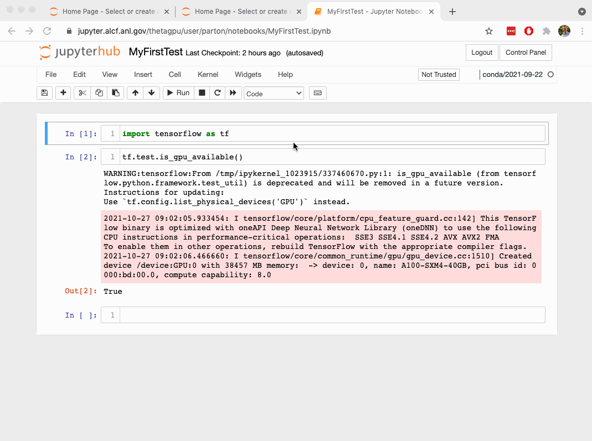

# Jupyter Notebooks on ThetaGPU

## Logging in
Login via: https://jupyter.alcf.anl.gov/

Select "Login ThetaGPU" and use your ALCF credentials and Multi-Factor Authentication.

## Server settings & start up

You'll want to set your server options to the following:
* job profile: ThetaGPU Compute Node
* ThetaGPU Queue: single-gpu
* Project List: ALCFAITP
* Runtime: can be 5 to 60 minutes

When you click "start" you are submitting a job to the batch queue and waiting for the job to begin.

## Server shutdown & logout

ALCF's guiding policy is:

> "We ask that all users follow good etiquette and be excellent to one another."

If you simply close your browser window, or logout without shutting down the jupyter server, your job will continue to occupy the worker node. Be considerate and shutdown your job when you finish.

[NEXT ->](./03_githubHomework.md)