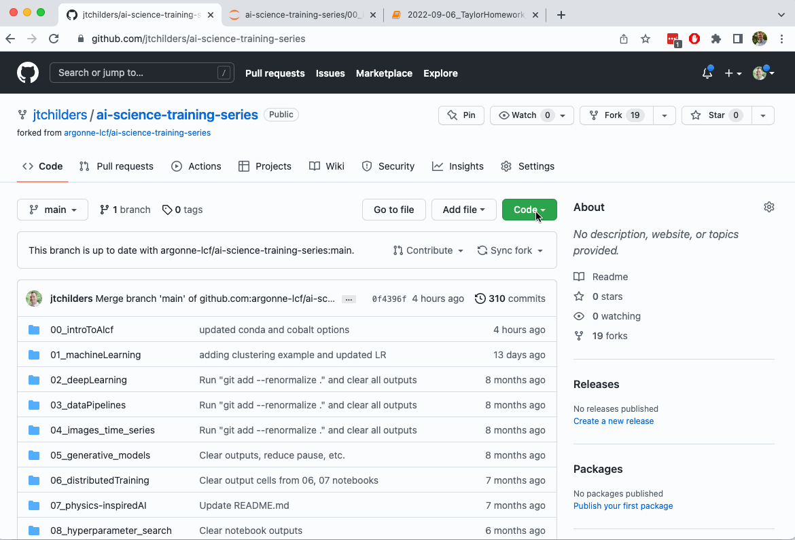
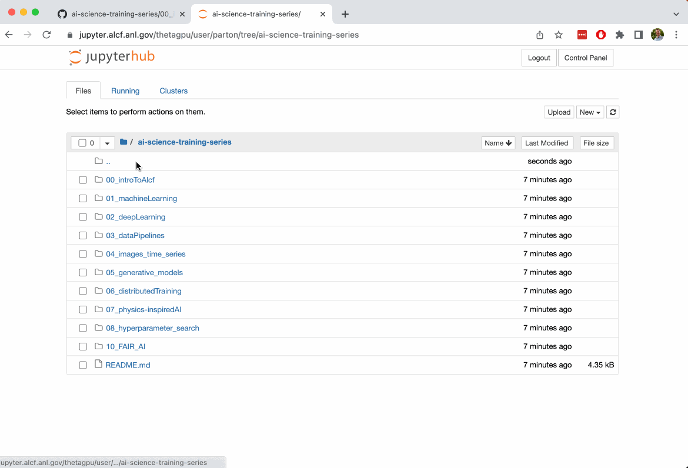

# GitHub Introduction: Homework Submissions

You will submit weekly homeworks via this Google Form: __put-here__
The form expects you to submit a URL to a file on [github.com](github.com). You will need an account on [GitHub](github.com) to do this.

You will also need to setup SSH Keys on github and in your ALCF account. 
* The SSH Key setup is [described here](https://docs.github.com/en/authentication/connecting-to-github-with-ssh/adding-a-new-ssh-key-to-your-github-account)
* Setup git on Theta (or target machine):
```bash
git config --global user.name "<first-name> <last-name>"
git config --global user.user "<github-username>"
git config --global user.email "<github-email-address>"
```

Navigate to the main page of this repository and follow the steps below. 

## Fork the repo on GitHub

This repository is controled by the ALCF account space, but you can make a copy in to your own github account space by _forking_ the repository as show here. Simply go to the main repository page and click the _fork_ button on the top right.


## Clone the repo in your Home directory

After you have forked the repo, login to Theta, and _clone_ the repository in to your home directory. 



## Do your homework

Some homework can be done via Jupyter notebooks, and others will be source code.

When you sign in to our Jupyter server, you see the contents of your home directory. There you can open your repository and create a new file with an appropriate name, like `YEAR-MONTH-DAY_Name_SessionNumber`.



## Upload your homework to your github repo

Now you need to:
- _add_ your new homework file to the list of tracked files in your repository
- _commit_ your file to the repository
- _push_ your commit to the web server at github

