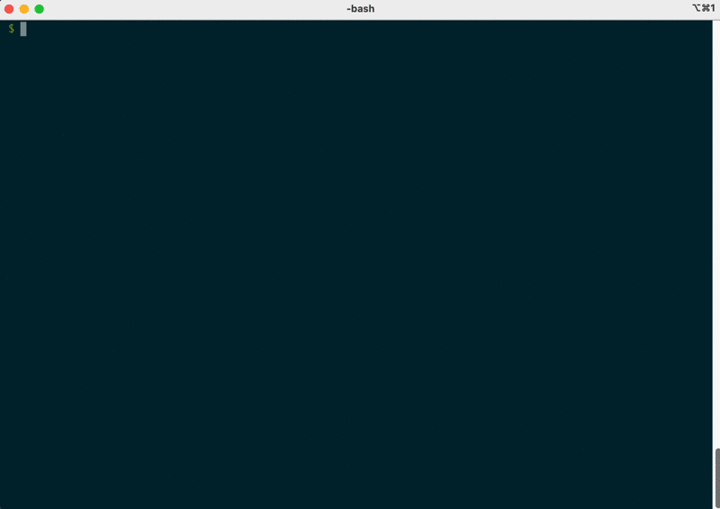

# How to run jobs on the system



Most of the time, there are not enough ThetaGPU compute nodes to run everyone's
workloads simultaneously.  Batch queueing systems solve this problem by
requiring that you submit your workload as a **batch job script** to a
queue.  All jobs wait in the queue until it's their turn to start,
whereupon the **Cobalt scheduler** allocates compute resources and launches the shell script onto the appropriate node.

When we submit a batch job script, we need to specify:

- The **shell script** that contains the commands to run
- The **number of compute nodes**  needed for the job.  In our examples, we will
stick to code that runs on  a single GPU within a node, and therefore always ask
for 1 node (`-n 1`).
- The maximum **walltime** in minutes that the job will run for.  We will ask for
fifteen minutes (`-t 15`).
-  The **queue** to which the job should be submitted.  Cobalt manages several queues
for each system; each queue is a separate line that jobs wait in until
they are eligible to start.  We will submit jobs to the "single GPU" queue designed
for routing jobs onto 1/8th of a DGX node (`-q single-gpu`).
- The **allocation** to which the used node-hours will be charged. Multiply the
number of nodes by the walltime to get the *node-hours* used by a batch job.  This is
the unit by which teams are charged for their usage of ALCF systems.  For instance, a
a single-node, 15-minute job would cost 0.25 node hours.  For the training exercises,
we can use a special training allocation set aside (`-A ALCFAITP`).

## Submitting a batch job script

To submit a minimal shell script, we need to make an executable file that starts with the very first
line `#!/bin/bash -l` indicating the `bash` shell interpreter will be used to run the job in login mode (`-l`):

```bash
#!/bin/bash -l

echo "Hello world!"

module load conda/2021-09-22
python -c 'print(1 + 1)'
```

Save this script into a file called `hello.sh` then run:

```shell
# Make the hello.sh script executable:
$ chmod +x hello.sh

# Submit hello.sh to the single-GPU Training queue:
$ qsub-gpu -A ALCFAITP -q single-gpu -n 1 -t 15 hello.sh
```

After running these commands, we should find that our job is
now waiting in the queue by checking `qstat-gpu`:

```shell
$ qstat-gpu -u $USER
```

Once the job starts running, you should find files ending with the `.output` and `.error` suffixes, which represent the standard output and standard error streams written from our executing batch job script:

```shell
$ ls
12345.output 12345.error

$ cat 12345.output
Hello world!
2
```

Instead of passing Cobalt parameters on the command line to `qsub-gpu`, we can also include these flags as **Cobalt directives** directly underneath the `#!/bin/bash -l` line:

```bash
#!/bin/bash -l
#COBALT -A ALCFAITP
#COBALT -q single-gpu
#COBALT -n 1
#COBALT -t 15

echo "Hello world!"

module load conda/2021-09-22
python -c 'print(1 + 1)'
```

If you change `hello.sh` to contain these `#COBALT` directives, you can submit the script without repeating any flags in the shell:

```bash
$ qsub-gpu hello.sh
```

There are many other Cobalt flags that you can use to control how your jobs run.
You should visit the ALCF website to read more about:
- [running jobs on ThetaGPU](https://www.alcf.anl.gov/support-center/theta-gpu-nodes/running-jobs-thetagpu) 
- [running jobs and submission scripts in general](https://www.alcf.anl.gov/support-center/theta/running-jobs-and-submission-scripts) 
- [ThetaGPU job queueing](https://www.alcf.anl.gov/support-center/theta-gpu-nodes/job-and-queue-scheduling-thetagpu).

## Example using PyTorch MNIST ML training


Some more realistic example job scripts are attached to this repository: try submitting `03_pytorch_mnist.sh` or `03_tensorflow_mnist.sh` to train a neural network on the MNIST classification task, using either PyTorch or Tensorflow, respectively.  You will find that these scripts tend to follow a simple pattern:

```bash
# Set up the Python environment
module load conda/2021-09-22
conda activate

# Run the Python model training script
python 03_pytorch_mnist.py
```

In upcoming sessions, you will learn more about these AI frameworks and how to write your own Python programs to build, train, and test deep learning models.

## Interactive jobs

Once you have figured out exactly what to run, Batch jobs are a great way to submit workloads and allow the system to take over scheduling. You can go do something else and log back onto the system another day to check on the status of your jobs.

When testing new ideas or developing a project, however, it's more useful to be able to **SSH directly onto a compute node** and run commands locally.  If you get something wrong, you can stay on the node while fixing bugs, instead of being kicked off and having to wait repeatedly for the next batch job to start.  To obtain a node interactively, all you have to do is **replace the batch job script** (`hello.sh`) **with the interactive flag** (`-I`):


```bash
$ qsub-gpu -n 1 -t 15 -q single-gpu -A ALCFAITP -I
```

This command will block until the node is available, and Cobalt will open a new SSH terminal having you logged into the compute node directly.
