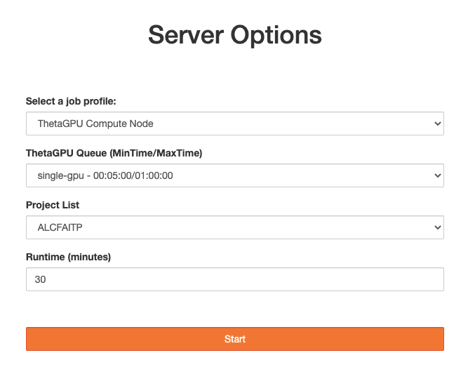

# Jupyter Notebooks on ThetaGPU

## Logging in
Login via: https://jupyter.alcf.anl.gov/

Select "Login ThetaGPU" and use your ALCF credentials and Multi-Factore Authentication.

## Server settings

You'll want to set your server options to the following:
* job profile: ThetaGPU Compute Node
* ThetaGPU Queue: single-gpu
* Project List: ALCFAITP
* Runtime: can be 5 to 60 minutes

