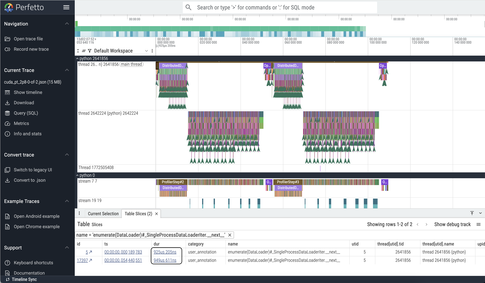
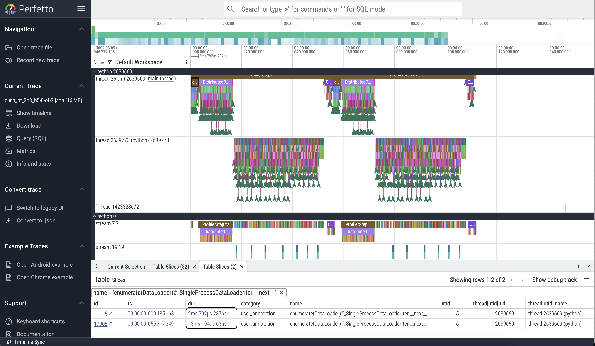

# Distributed training with PyTorch

## Why distributed training:
Training the best AI models today require a large amount of compute capacity and
memory. Trillion parameter models are available for consumption, and we may try 
to do a back of the envelope calculation to estimate the requirements! 

- Store the parameters 
    - Total number of parameters $10^{12}$ $\times$ Memory per parameters
    - With FP16 -- each parameter requires 2 Bytes
    - $2 \times 10^{12}$ = $2$ TB
- Store the Gradients
    - Gradients are stored for each parameter
    - Takes $2$ TB
- Store the Optimizer States
    - Consider Adam Optimizer
    - Requires storing 2 additional states (momentum and variance)
    - $2 \times 2$ = $4$ TB
- Store Activations
    - These are dependent on Number of layers, sequence length, and hidden 
    dimension and batch size
    - Typical, layers=$120$, Sequence length=$2$k, Hidden Dimension=$12$K, and
    Batch Size=$128$
    - $128 \times 120 \times 2048 \times 12288 \times 2$ ~ $0.8$ TB

So, in total, we will need at least $10.8$ TB of memory.

And we need these parameters on the GPU to perform each step of the training 
loop! One of the flagship GPUs today have memory of ~140 GB ([Nvidia B200](https://www.nvidia.com/en-us/data-center/dgx-b200/))
Clearly, if we want to train a trillion parameter model, we will require more 
than 1 GPU. If we target one of the largest publicly available models, [llama-405b](https://huggingface.co/meta-llama/Llama-3.1-405B)
we would still require $810$ GB of memory -- just for the parameters! Hence 
distributed training is a must!

Training a large model requires, more than just the parameters. It requires 
training data and optimizers to calculate losses which increases the memory 
requirements. Today, we will talk about a scenario, where our model is small 
enough to fit on a GPU but our dataset is large enough that we will need more 
than 1 GPU. This is commonly known as the Data Parallel training.

_Note_: To quickly estimate the resource requirements of a model training, the
shortcut could be: Trillion($10^{12}$)  parameter models ~ TB, Billion 
($10^{9}$) parameter models ~ GB. If FP16, then $2$ Bytes per parameters, if
FP8, then $1$ Byte per parameter -- each lower precision, reducing by a factor 
of two! Also, gradients will take same memory as parameters, optimizers take 
double the memory. The activations are a bit complicated, but if we consider 
them similar to the optimizers, then our lower estimate by summing all of them
up should be fairly reliable!

## A single GPU program with a random dataset:

Here we are presenting a simple example, where we use the base transformer 
model in its default configuration, with a synthetic dataset to demonstrate 
how to implement a training loop.

```
import torch
+ device = torch.device('cuda')

torch.manual_seed(0)

src = torch.rand((2048, 1, 512))
tgt = torch.rand((2048, 20, 512))
dataset = torch.utils.data.TensorDataset(src, tgt)
loader = torch.utils.data.DataLoader(dataset, batch_size=32, shuffle=True)

model = torch.nn.Transformer(batch_first=True)
optimizer = torch.optim.Adam(model.parameters(), lr=0.001)
criterion = torch.nn.CrossEntropyLoss()
model.train()
+ model = model.to(device)

for epoch in range(10):
    for source, targets in loader:
+         source = source.to(device)
+         targets = targets.to(device)
        optimizer.zero_grad()

        output = model(source, targets)
        loss = criterion(output, targets)

        loss.backward()
        optimizer.step()
```

The first step is to set the device to `'cuda'`, in doing so, we inform PyTorch
that we have an Nvidia GPU to work on. After that, we create synthetic data
using `torch.rand` for the `batch_first=True` mode in the format 
(Batch, Sequence Length, Feature Number). Here we have taken the original 
transformer architecture for a demonstration purposes. More details about many
other variants can be found in this [PyTorch Tutorial](https://docs.pytorch.org/tutorials/intermediate/transformer_building_blocks.html)

Note that, we are creating the synthetic dataset through the `TensorDataset`
method from `torch.utils.data` using the CPU tensors, created directly in the
memory. Later, we will explore another method involving files and examine the
effects of I/O in the context of this example.

Once our dataset and the data loader is ready, we choose an optimizer and the
type of loss we want and proceed with the training loop, where we load the
data into the GPU using the `.to` method from PyTorch, calculate the output 
and do a backward pass with an optimizer step.

## Distributed Training on multiple GPUs

Distributed data parallel training can be facilitated through PyTorch's native
[Distributed Data Parallel Method](https://docs.pytorch.org/tutorials/intermediate/ddp_tutorial.html),
commonly known as DDP. Here we will highlight the changes that needs to be done
to leverage DDP for our example:

### Code changes to train on multiple GPUs using PyTorch Distributed Data Parallel (DDP)

```
+ from mpi4py import MPI
+ import os, socket
import torch
+ from torch.nn.parallel import DistributedDataParallel as DDP

# DDP: Set environmental variables used by PyTorch
+ SIZE = MPI.COMM_WORLD.Get_size()
+ RANK = MPI.COMM_WORLD.Get_rank()
+ LOCAL_RANK = os.environ.get('PALS_LOCAL_RANKID')
+ os.environ['RANK'] = str(RANK)
+ os.environ['WORLD_SIZE'] = str(SIZE)
+ MASTER_ADDR = socket.gethostname() if RANK == 0 else None
+ MASTER_ADDR = MPI.COMM_WORLD.bcast(MASTER_ADDR, root=0)
+ os.environ['MASTER_ADDR'] = f"{MASTER_ADDR}.hsn.cm.polaris.alcf.anl.gov"
+ os.environ['MASTER_PORT'] = str(2345)
+ print(f"DDP: Hi from rank {RANK} of {SIZE} with local rank {LOCAL_RANK}. {MASTER_ADDR}")

# DDP: initialize distributed communication with nccl backend
+ torch.distributed.init_process_group(backend='nccl', init_method='env://', rank=int(RANK), world_size=int(SIZE))

# DDP: pin GPU to local rank.
+ torch.cuda.set_device(int(LOCAL_RANK))
device = torch.device('cuda')
torch.manual_seed(0)

src = torch.rand((2048, 1, 512))
tgt = torch.rand((2048, 20, 512))
dataset = torch.utils.data.TensorDataset(src, tgt)
# DDP: use DistributedSampler to partition the training data
+ sampler = torch.utils.data.distributed.DistributedSampler(dataset, shuffle=True, num_replicas=SIZE, rank=RANK, seed=0)
+ loader = torch.utils.data.DataLoader(dataset, sampler=sampler, batch_size=32)

model = torch.nn.Transformer(batch_first=True)
# DDP: scale learning rate by the number of GPUs.
+ optimizer = torch.optim.Adam(model.parameters(), lr=(0.001*SIZE))
criterion = torch.nn.CrossEntropyLoss()
model.train()
model = model.to(device)
# DDP: wrap the model in DDP
+ model = DDP(model)

for epoch in range(10):
    # DDP: set epoch to sampler for shuffling
+     sampler.set_epoch(epoch)

    for source, targets in loader:
        source = source.to(device)
        targets = targets.to(device)
        optimizer.zero_grad()

        output = model(source, targets)
        loss = criterion(output, targets)

        loss.backward()
        optimizer.step()

# DDP: cleanup
+ torch.distributed.destroy_process_group()
```
A few points to notice here:

- We need to be able to count the ranks, for example, the total number of GPU 
ranks, the number of GPU ranks per node etc. to effectively launch our 
distributed training. This can be done in many ways, here we choose to leverage
`mpi4py` and the Parallel Application Launch Service (PALS), an HPE tool as a support
to the PBS workload manager at ALCF systems. We use
    - `mpi4py` to calculate the global size, i.e. total number of GPU ranks
    - `mpi4py` to determine the global rank count, i.e, on 2 Polaris nodes it is
    0-7
    - `PBS_LOCAL_RANKID` to determine the rank id of GPU within a host node. 
        More details on PALS can be found in the [PALS Documentation](https://support.hpe.com/hpesc/public/docDisplay?docId=dp00005984en_us&page=user/pbs/PALS.html&docLocale=en_US).
- We need to fix a master node and get the address of the master node and 
broadcast that to all the ranks, and then initialize a distributed process 
group with all the ranks participating in the training. A key element here is 
the `backend` for this process group to perform communication. A standard choice
for Nvidia GPU based clusters is the `'nccl'` backend, to leverage Nvidia's 
vendor specific [collective communication library](https://docs.nvidia.com/deeplearning/nccl/user-guide/docs/index.html).
- Modify the __learning rate__. As we increase the number of GPUs, the effective
batch size scales proportionately with the numbers of ranks, as each rank will 
take a unique subset of the data. The larger batch size lead to more stable 
gradient computation as they are averaged over a larger volume of samples. This
larger volume is scaled proportional to the number of ranks, and hence, 
effectively the gradient update is scaled down by the number of ranks. To 
restore the learning rate from the single rank case, we scale the learning rate
up by the number of GPUs. More details are in the 
[2018 Facebook ImageNet paper](https://arxiv.org/abs/1706.02677).

The code above has been implemented and provided in the repository and 
associated job scripts for Polaris. We will work through them in the hands-on 
section.

## How well is our code doing -- Profile
Now that we have a working example, we will try to profile it using the PyTorch
profiler. Profilers give us many information, for example:

- Data loading
- Compute
- Memory access patterns
- Communication (specially in distributed computing)

In this age and time, where we are increasingly becoming more dependent on
external codes, and models; perhaps, a profiler can be treated as a useful
_learning tool?_


There are many profilers available for profiling AI/ML applications, specially
coming from vendor specific software stack. The PyTorch profiler gives us a
native profiling capability which can be useful in comparing the performance of
an application across different hardware.

### Information provided by the profiler

The PyTorch profiler can provide us various information, including, but not
limited to:

- __Operator Execution Time__ (CPU time & GPU time): Typically they are denoted as
`cpu_op`s and `kernel`s
- __Kernel Execution Details__: Including launch time and duration of execution
- __Operator Input Shapes__: This is optional, by setting`record_shapes=True`
while initializing the profiler, we can see the shapes of the matrices computed
    by a `gemm` kernel, for example.
- __Stack Traces__ and __Module Hierarchy__: Setting `with_stack=True`
allows the profiler to record the Python source code location
(file and line number) that invoked each operation.
- __Estimated FLOPs__: For certain common operators like matrix multiplication and
2D convolution, the profiler can estimate the number of
floating-point operations (FLOPs) performed if `with_flops=True` is set.
This can help in assessing the computational intensity of different parts of
the model.
- __Execution Timeline (Trace View)__: Perhaps the most widely used and
powerful feature for detailed analysis is the ability to export a chronological
trace of events. This comes as a `JSON` file, and can be viewed using the
[perfetto trace viewer](https://ui.perfetto.dev/). We will do a hands-on
exercise to view the trace of our simple example.

### Eanbling the profiler

We enable the PyTorch profiler in a way that allows us to tell the profiler
when to take the next step. For that we do the following:

```python
from torch.profiler import profile, record_function, ProfilerActivity

activities=[ProfilerActivity.CPU, ProfilerActivity.CUDA]

schedule = torch.profiler.schedule(wait=1, warmup=1, active=2, repeat=1)
prof = profile(activities=activities, record_shapes=True, schedule=schedule, profile_memory=True)
prof.start()

for epoch in range(10):
    if RANK == 0:
        print(epoch)
    # DDP: set epoch to sampler for shuffling
    sampler.set_epoch(epoch)

    for source, targets in loader:
        source = source.to(device)
        if RANK == 0:
            print(f"Microbatchsize = {source.shape[0]}")
        targets = targets.to(device)
        optimizer.zero_grad()

        output = model(source, targets)
        loss = criterion(output, targets)

        loss.backward()
        optimizer.step()
        prof.step()

os.makedirs(args.trace_dir, exist_ok=True)
prof.export_chrome_trace(f"{args.trace_dir}/cuda_pt_2p8-{RANK}-of-{SIZE}.json")
output_path = f"{args.trace_dir}/cuda_pt_2p8_self_cuda_time_total-{RANK}-of-{SIZE}.txt"
os.makedirs(os.path.dirname(output_path), exist_ok=True)

with open(output_path, "w") as f:
    f.write(prof.key_averages().table(
        sort_by="cuda_time_total", row_limit=-1))
```

#### Another way of enabling the profiler

To trace individual functions in a complex code, the profilers `record_function`
method can be used as well:

```
with profilel(activities=[ProfilerActivity.CPU, ProfilerActivity.XPU],
 record_shapes=True,
 profile_memory=True,
 with_stack=True) as prof:
    with record_function(“data_preprocessing”): #user custom annotation
        ...
        # portion of the code you would like to
    train(model, loader, epochs=args.epochs, steps_per_epoch = args.steps)
```
This method works well for non-compiled use cases. If we want to profile a
compiled model, this method may not work, as indicated by the following warning
message generated during my attempts:

```
[rank1]:W1014 04:35:13.299000 2672109 site-packages/torch/_logging/_internal.py:1154] 
[0/0] Profiler function <class 'torch.autograd.profiler.record_function'> will be ignored
```
## Read the data from a file
At this point we have all the tools needed for simulating a situation closer to
real life! In our example of generating synthetic data bypasses a significant 
bottle neck of an actual training event. In this case, every rank generates its
own data and loops over it, that removes the complete data I/O mechanism, which is
critical to Deep Learning workloads.

The data can come from many different sources, and in many different file 
formats. Specially for multi-modal trainings. Once we have the data, we would 
like to transform it to a data format based on PyTorch tensors, which is well
suited for training iterations with PyTorch. 
More here: [Torch Transform Tutorial](https://docs.pytorch.org/tutorials/beginner/basics/transforms_tutorial.html)

For demonstration purposes, we write the synthetic data in an `h5` file, and 
access it through the `h5py` library. `h5` is quite popular in the deep 
learning space, and has many features that makes storage in an organized 
fashion possible. Then at each iteration, we read from the file. Here are the
snapshots for the data loading part of the profiles.


Notice, the slowest data loading step is ~950 us,

Whereas, with the `h5` file as an input source


the slowest data loading step is ~3 ms! Roughly 3x slowdown! There are other 
file formats `.pt` and `safetensors` that are used for production runs, but
this remains a significant bottleneck in the training steps.

## Collectives
An important part of the distributed training is the collective communication.
Notice that, we __did not__ explicitly call any collective communication 
operation in our example, except the `barrier` in the data creation step. We 
needed the other ranks to be on hold until Rank 0 is done preparing the data. 
The collectives are done for us under the hood in the backward pass step. We 
can look at the profiles and find out what kind of collectives are happening, 
and how long is it taking.


In this case, the collective is an _allreduce_ to do gradient synchronization 
and the slowest of them is taking ~1.5 ms, almost half of the I/O time.

Here we have identified one of the two key bottlenecks of the large scale 
trainings using PyTorch profiler.

## `torch.compile`

`torch.compile` is another mode of operation which can provide better 
performance in appropriate cases through JIT-compilation, functional 
transformation and further optimizing the functional transformation graphs for
more efficient execution. More here: [Torch Compile Tutorial](https://docs.pytorch.org/tutorials/intermediate/torch_compile_tutorial.html#introduction-to-torch-compile)

This at the very high level can be as simple as wrapping the model around with
`torch.compile` or in some cases as `model().compile()`. We have an example 
case ready to play with an implementation of the first instance

```
model = torch.compile(model)
```

## Homeworks

- Make sure that the single GPU code runs on Polaris.
- The counting of ranks, does not necessarily has to be a mix-and-match between
`mpi4py` and `PALS`. Try to implement the rank counting method using just 
`PALS` or `mpi4py`. `device_count()` methods can be useful here.
- Play with different dimensions of the `src` and `tgt` tensors.
- Explore the cost of collective communication, by setting up a scenario, 
where you have only two ranks, but each rank resides on a different node. 
Profile and try to reason about the results.
- Try other file formats to explore the I/O bottleneck.
- Make the tensors really large, specially the 2nd and 3rd dimension and 
explore different data types.


