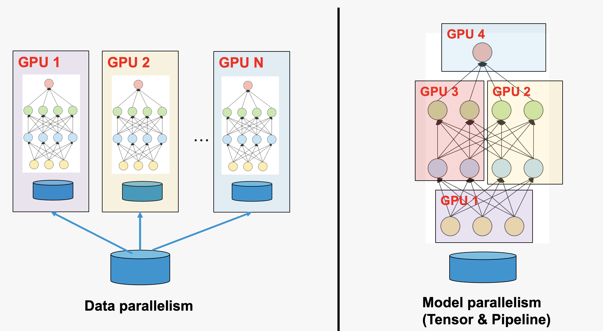

# Parallel computing
**Parallel computing** refers to the process of breaking down larger problems into smaller, independent, often similar parts that can be executed simultaneously by multiple processors communicating via network or shared memory, the results of which are combined upon completion as part of an overall algorithm.

## $\pi$ example
We can calculate the value of $\pi$ using a MPI parallelized version of the Monte Carlo method. The basic idea is to estimate $\pi$ by randomly sampling points within a square and determining how many fall inside a quarter circle inscribed within that square.


```python
from mpi4py import MPI
import numpy as np
import random
import time
comm = MPI.COMM_WORLD

N = 5000000
Nin = 0
t0 = time.time()
for i in range(comm.rank, N, comm.size):
    x = random.uniform(-0.5, 0.5)
    y = random.uniform(-0.5, 0.5)
    if (np.sqrt(x*x + y*y) < 0.5):
        Nin += 1
res = np.array(Nin, dtype='d')
res_tot = np.array(Nin, dtype='d')
comm.Allreduce(res, res_tot, op=MPI.SUM)
t1 = time.time()
if comm.rank==0:
    print(res_tot/float(N/4.0))
    print("Time: %s" %(t1 - t0))
```

```bash
ssh <username>@polaris.alcf.anl.gov
qsub -A ALCFAITP -l select=1 -q debug -l walltime=0:30:00 -l filesystems=home:eagle
module load conda/2023-10-04
conda activate /soft/datascience/ALCFAITP/2023-10-04
cd YOUR_GITHUP_REPO
mpirun -np 1 python pi.py   # 3.141988,   8.029037714004517  s
mpirun -np 2 python pi.py   # 3.1415096   4.212774038314819  s
mpirun -np 4 python pi.py   # 3.1425632   2.093632459640503  s
mpirun -np 8 python pi.py   # 3.1411632   1.0610620975494385 s
```

## Parallel computing in AI

**AI = data + model**

* **Data parallelism** - different GPU work on different data
* **Model parallelism** - differetn GPU work on different part of the model
