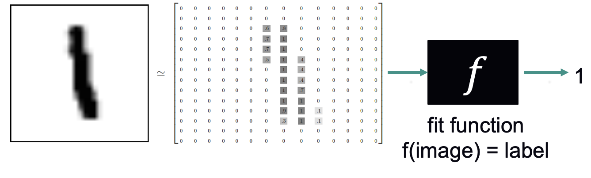

# Introduction to Neural Networks 

Author: Bethany Lusch (blusch@anl.gov), combining and adapting materials evolved over time by Marieme Ngom, Asad Khan, Prasanna Balaprakash, Taylor Childers, Corey Adams, Kyle Felker, and Tanwi Mallick 

This tutorial covers the basics of neural networks (aka "deep learning"), which is a technique within machine learning that tends to outperform other techniques when dealing with a large amount of data. 

This is a quick overview, but the goals are:
- to introduce the fundamental concepts of deep learning through hands-on activities
- to give you the necessary background for the more advanced topics in the coming weeks.

Some rough definitions:
- Artificial intelligence (AI) is a set of approaches to solving complex problems by imitating the brain's ability to learn. 
- Machine learning (ML) is the field of study that gives computers the ability to learn without being explicitly programmed (i.e. learning patterns instead of writing down rules.) Arguably, machine learning is now a subfield of AI. 

Last week, we learned about using linear regression to predict the sale price of a house. We fit a function to the dataset:
- Input: above ground square feet
- Output: sale price
- Function type: linear 
- Loss function: mean squared error 
- Optimization algorithm: stochastic gradient descent 

This week, we'll work on a "classification" problem, which means that we have a category label for each data point, and we fit a function that can categorize inputs. 

The [MNIST dataset](http://yann.lecun.com/exdb/mnist/) contains thousands of examples of handwritten numbers, with each digit labeled 0-9.


We'll start with the MNIST problem in this notebook: 
[Fitting MNIST with a multi-layer perceptron (MLP)](01_introduction_mnist.ipynb)

Next week, we'll learn about other types of neural networks. 


## Environment Setup
1. If you are using ALCF, first log in. From a terminal run the following command:
```
ssh username@polaris.alcf.anl.gov
```

2. Although we already cloned the repo before, you'll want the updated version. To be reminded of the instructions for syncing your fork, click [here](https://github.com/argonne-lcf/ai-science-training-series/blob/main/00_introToAlcf/03_githubHomework.md). 

3. Now that we have the updated notebooks, we can open them. If you are using ALCF JupyterHub or Google Colab, you can be reminded of the steps [here](https://github.com/argonne-lcf/ai-science-training-series/blob/main/01_intro_AI_on_Supercomputer/01_linear_regression_sgd.ipynb). 

4. Reminder: Change the notebook's kernel to `datascience/conda-2023-01-10` (you may need to change kernel each time you open a notebook for the first time):

    1. select *Kernel* in the menu bar
    1. select *Change kernel...*
    1. select *datascience/conda-2023-01-10* from the drop-down menu


## __References:__

Here are Asad Khan's recommendations for further reading:

- [tensorflow.org tutorials](https://www.tensorflow.org/tutorials)
- [keras.io tutorials](https://keras.io/examples/)
- [CS231n: Convolutional Neural Networks for Visual Recognition](http://cs231n.stanford.edu/)
- [Deep Learning Specialization, Andrew Ng](https://www.coursera.org/specializations/deep-learning?utm_source=deeplearningai&utm_medium=institutions&utm_campaign=WebsiteCoursesDLSTopButton)
- [PyTorch Challenge, Udacity](https://www.udacity.com/facebook-pytorch-scholarship)
- [Deep Learning with Python](https://www.amazon.com/Deep-Learning-Python-Francois-Chollet/dp/1617294438)
- [Keras Blog](https://blog.keras.io/)


And Bethany's personal favorite: a thorough hands-on textbook: [book](https://www.oreilly.com/library/view/hands-on-machine-learning/9781492032632/) with [notebooks](https://github.com/ageron/handson-ml2).
