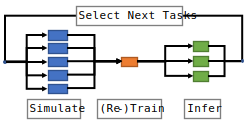
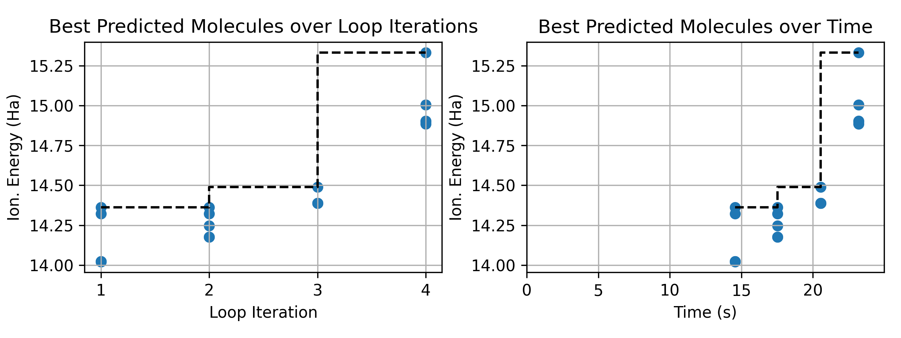

# ML-In-The-Loop Workflow for Molecular Design with Parsl

This example demonstrates a simple molecular design application combining simulations with machine learning (ML) training and inference. The objective is to efficiently identify molecules with the largest ionization energies from a large dataset of potential candidates. 

The example was adapted from an [ExaWorks demo](https://github.com/ExaWorks/molecular-design-parsl-demo/tree/main) developed by Logan Ward, ANL.

The ionization energy (IE) of a molecule is the amount of energy required to remove one electron from the molecule in its ground state to produce a positively charged ion. 
IE can be computed using various simulation packages (here we use [xTB](https://xtb-docs.readthedocs.io/en/latest/contents.html)); however, execution of these simulations can be expensive, and thus, given a finite compute budget and a large set of molecules to screen, we must carefully select which molecules to explore by simulation. 
To help reduce the cost of screening large datasets of potential candidate molecules, we use machine learning, specifically a k-nearest neighbors (KNN) regressor, to predict the IE of molecules based on previously simulated data. 
We then employ an iterative process often called [active learning](https://pubs.acs.org/doi/abs/10.1021/acs.chemmater.0c00768) to simulate the best identified compounds and retrain the KNN model to improve the accuracy of predictions. 
A schematic of the active learning, or ML-in-the-loop, workflow is shown below.



For this example, we use [Parsl](https://github.com/Parsl/parsl) to execute functions (simulation, model training, and inference) in parallel. Parsl allows us to establish dependencies in the workflow and to execute the workflow on arbitrary computing infrastructure, from laptops to supercomputers. We show how Parsl's integration with Python's native concurrency library (i.e., [`concurrent.futures`](https://docs.python.org/3/library/concurrent.futures.html#module-concurrent.futures)) lets you write applications that dynamically respond to the completion of asynchronous tasks.

### Parsl Setup

We first configure Parsl to make use of available resources. In this case, we configure Parsl to run on the Polaris supercomputer. This example does not use GPUs (both the xTB simulations and the KNN model can run efficiently on CPUs), so we set one worker per physical CPU for a total of 32 workers per node.  For a GPU application, we would change the configuration to pin one worker per GPU as in the [producer-consumer example](../producer-consumer/parsl_config.py).

One of the benefits of Parsl is that we can change this configuration to make use of different resources without modifying the application code. For example, we can configure Parsl to use more cores on the local machine or to use many nodes on a Supercomputer or Cloud. The [Parsl website](https://parsl.readthedocs.io/en/stable/userguide/configuring.html) describes how Parsl can be configured for different resources.

The Parsl Config for this example is in the file [parsl_config.py](./parsl_config.py).

### Creating a Parsl Python App and Launching a Simulation

Second, we look at a minimal example to understand how to submit a Python function with Parsl, as shown in [1_run_simulation.py](./1_run_simulation.py). 
Using the `compute_vertical` function, which computes the ionization energy of a molecule with the xTB package, we prepare this function to run with Parsl by wrapping it with Parsl's `python_app`:

```python
compute_vertical_app = python_app(compute_vertical)
```

This new object is a Parsl `PythonApp`. It can be invoked like the original function, but instead of immediately executing, the function may be run asynchronously by Parsl. Instead of the result, the call will immediately return a `Future`, which we can use to retrieve the result or obtain the status of the running task.

For example, invoking the `compute_vertical_app` with the SMILES for water, `O`, returns a Future and schedules `compute_vertical` for execution in the background.


```python
future = compute_vertical_app('O') #  Run water as a demonstration (O is the SMILES for water)
```

We can access the result of this computation by asking the future for the `result()`. If the computation isn't finished yet, then the call to `.result()` will block until the result is ready.

```python
ie = future.result()
```

To run a single simulation as a Parsl `PythonApp`, execute 

```bash
python 1_run_simulation.py
```

### Launching Multiple Tasks in Parallel with Data Dependencies

Now we can look at a slightly more complex workflow which executes multiple tasks in parallel with data dependencies, as shown in [2_training_and_inference.py](./2_training_and_inference.py).

We use a standard Python loop to submit a set of simulations for parallel execution. As above, each invocation returns a `Future` immediately, so this code should finish within a few milliseconds. 

```python
smiles = search_space.sample(initial_count)['smiles']
futures = [compute_vertical_app(s) for s in smiles]
```

Because we do not call `.result()` immediately, this code does not wait for any results to be ready. Instead, Parsl is running the computations concurrently in the background. Parsl manages sending work to each worker process, collecting results, and feeding new work to workers as new tasks are submitted. 

The futures produced by Parsl are based on Python's [native "Future"](https://docs.python.org/3/library/concurrent.futures.html#future-objects) object,
so we can use Python's utility functions to work with them.

In collecting simulation results, we use `as_completed` to take an iterable (in this case, a list) of futures and to yield as each future completes.  Thus, we progress and handle each simulation as it completes.  The data are loaded into a pandas `DataFrame` containing the randomly sampled molecules alongside the simulated ionization energy (`ie`). In addition, the code above has stored some metadata (`batch` and `time`), which we will use later.

The next part of the script creates a machine learning model to estimate the outcome of new computations (i.e., ionization energy) and uses it to rapidly scan the search space.

We are going to use RDKit and scikit-learn to train a k-nearest neighbor model that uses Morgan fingerprints to define similarity (see [notes from a UChicago AI course](https://github.com/WardLT/applied-ai-for-materials/blob/main/molecular-property-prediction/chemoinformatics/2_ml-with-fingerprints.ipynb) for more detail). In short, the function trains a model that first populates a list of certain substructures (Morgan fingerprints, specifically) and then trains a model that predicts the IE of a new molecule by averaging those with the most similar substructures.

The training and inferencing scripts are provided in the `chemfunctions` module. 
We define the Parsl apps for these functions as before with the `python_app` API

```python
train_model_app = python_app(train_model)
inference_app = python_app(run_model)
```

One of the unique features of Parsl is that it can create workflows on-the-fly directly from Python. Parsl workflows are chains of functions, connected by dynamic dependencies (i.e., data passed between Parsl `apps`), that can run in parallel when possible.

To establish the workflow, we pass the future created by executing one function as an input to another Parsl function.  We therefore pass a future for the `train_model_app` to the `inference_app`, and we only have to wait for the completion of the inference future.  Parsl will automatically wait for the training future before running inference:

```python
train_future = train_model_app(train_data)
inference_future = inference_app(train_future, chunk)
inference_future.result()
```

While this script runs inferences in parallel, we can define the final part of the workflow to combine results into a single DataFrame using `combine_inferences`.

```python
@python_app
def combine_inferences(inputs=[]):
    """Concatenate a series of inferences into a single DataFrame
    Args:
        inputs: a list of the component DataFrames
    Returns:
        A single DataFrame containing the same inferences
    """
    import pandas as pd
    return pd.concat(inputs, ignore_index=True)
```

In defining `combine_inferences`, `python_app` is used as a decorator directly on the function definition (earlier we defined a regular function, and then applied `python_app` afterwards).
We pass the `inference_futures` as inputs to `combine_inferences` such that Parsl knows to establish a dependency between these two functions. Since Parsl will ensure that `train_future` must complete before any of the `inference_app` tasks start, and all of the `inference_app` tasks must be finished before `combine_inferences` starts, all we need to do is wait on the result of the `combine_inferences` future to ensure the workflow completes and dependencies are honored.

To test this more complex workflow, execute 

```bash
python 2_training_and_inference.py
```

### ML-in-the-loop (active learning) Workflow

Finally, we build the full active learning workflow (see [3_ml_in_the_loop.py](./3_ml_in_the_loop.py)), which uses the ML model to pick a batch of simulations, runs the simulations in parallel, and then uses the data to retrain the model before repeating the loop.

Our application uses `train_model_app`, `inference_app`, and `combine_inferences` as above, but after running an iteration, it picks the predicted best molecules and runs the `compute_vertical_app` to run the xTB simulation on those top candidates.  The workflow then repeatedly retrains the model using these results until a pre-determined number of simulations have been trained. 

The workflow is initialized with the following parameters, which determine how much data is to be generated via simulation for pre-training of the KNN model, the maximum size of the training dataset (thus also the maximum number of simulations to perform), and how many new simulations to perform and training data points to generate for each active learning iteration. These parameters strike a balance between pre-training and fine-tuning the model and can influence the accuracy of the model.

```python
# Define parameters for the workflow
initial_training_count = 8  # Number of training samples to collect for first model training
max_training_count = 24  # Maximum number of training samples to collect for training
batch_size = 4  # Number of molecules to simulate in each iteration of active learning loop
```

To check the performance of the active learning loop, the script outputs useful information for each iteration to the terminal and, after terminating the loop, generates a plot of the best identified molecules over loop iteration and run time. These logs and plots will be useful for the homework problem.

To run the full ML-in-the-loop workflow, execute

```bash
python 3_ml_in_the_loop.py
```

## Run Instructions

1. Submit an interactive job:

    ```bash
    qsub -I -l select=1 -l walltime=01:00:00 -q ALCFAITP -l filesystems=home:eagle -A ALCFAITP
    ```

2. Source the environment provided:

    ```bash
    source ../0_activate_env.sh
    ```

3. Run the Parsl workflow scripts in order of complexity

    ```bash
    python 1_run_simulation.py
    python 2_training_and_inference.py
    python 3_ml_in_the_loop.py
    ```


## Performance of the Active Learning Loop (Homework)

Tune the parameters of the ML-in-the-loop active learning workflow in order to find molecules with the largest ionization energy in the shortest possible time. 

Use the PBS submit script [4_submit_multinode.sh](./4_submit_multinode.sh) to run the full workflow on 1 or multiple nodes of Polaris. 
Note that all that should be needed for this exercise is to change the values of the `initial_training_count`, `max_training_count` and `batch_size` variables at the top of the `3_ml_in_the_loop.py` script in order to balance pre-training with fine-tuning of the model.

The script will generate a figure with the results of the active learning loop called `parsl_ml_in_the_loop.png`. Use this figure to determine the performance of your tests. Once ready to submit, simply commit the repository with the updated image showing your best results, which will automatically be populated below in this README file.


