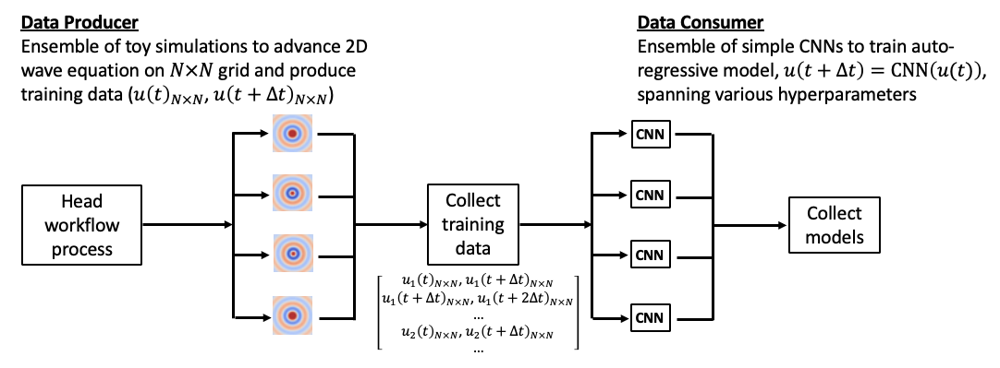

# Producer-Consumer Workflow with Parsl and DragonHPC

This example uses a simplified producer-consumer pattern to demonstrate how coupled simulation and AI workflows can encounter bottlenecks around data storage and data transfer as our scientific problems scale up in size on modern HPC systems. 
The scripts provided implement the same workflow three times, however highlighting three different approaches for transfering data between the data-producing simulations and the data-consuming ML training instances, namely using serialization and streaming over TCP, using the parallel file system, and using a distributed in-memory key-value store with fast inter-mode RDMA transfers. 
By following the hands-on exercises and homework problem, you will experience first hand the performance bottlenecks of each implementation.

The workflow is composed of an ensemble of toy simulations feeding training data to a second ensemble of ML training instances which learn an auto-regressive convolutional neural network (CNN) (i.e., a model which uses its own previous outputs to predict the next output). 
The workflow is designed to emulate common workflow patterns in this area, wherein a number of simulations with different input parameters are used to generate data for training multiple ML models spanning various hyper-parameters. 



The toy simulation is set up to emulate a PDE solver advancing the solution of a dynamical system, however, for simplicity, in this example the simulation simply generates instances of the 2D circular wave equation on a square grid. The simulation was intentionally designed to be computationally simple and run on CPUs such that many of these instances could be launched on each node and produce large amounts of data.
The `simulation` function shown below takes as arguments the wave period and the size of the grid on which to compute the solution, and using this information simulates a time step loop to advance the solution and accumulate training data. The training data is composed of the solution at a time *t*, which forms the input to the model, and the solution at the next timestep *t+dt*, which forms the output of the model. The training data is accumulated in the time step loop and then shared with the consumer using various approaches. In the workflow, the ensemble of simulations is launched with the same grid size, but different wave periods in order to emulate a parameter sweep. 

```python
def simulation(period, grid_size):
    """Toy simulaiton function to advance the circular wave equation in 2D
    and produce training data for an autoregressive CNN model (u(x,t+1) -> CNN(u(x,t)))
    Args:
        period: period of wave
        grid_size: size of each dimension of the grid (2D grid is a square of size grid_size x grid_size)
    """
    # Setup grid
    n_samples = grid_size**2
    x = np.linspace(0,1,num=grid_size)*4*PI-2*PI
    y = np.linspace(0,1,num=grid_size)*4*PI-2*PI
    x, y = np.meshgrid(x, y)
    r = np.sqrt(x**2+y**2)

    # Loop over steps to generate training data
    freq = 2*PI/period
    inputs = []
    outputs = []
    for step in range(10):
        sleep(0.5) # sleep to emulate the compute time
        u = np.sin(2.0*r-freq*step)/(r+1.0)
        udt = np.sin(2.0*r-freq*(step+1))/(r+1.0)
        inputs.append(u)
        outputs.append(udt)
```

The ML side of the workflow is set up to train a very simple CNN model which takes as input the solution at time *t* on a square 2D grid and predicts the solution at the next time step on the same grid, thus representing the common task in scientific ML of surrogate modeling. The model can be instantiated with different values of the kernel size for the convolution operations in order to represent changes to the underlying architecture commonly done during hyper-parameter optimization.

```python
class SimpleCNN(nn.Module):
    """Simple autoregressive CNN model to predict the next step of a wave equation
    """
    def __init__(self, kernel_size: int = 3):
        super().__init__()
        # Encoder: extract spatial features
        self.conv1 = nn.Conv2d(1, 8, kernel_size=kernel_size, padding='same')
        self.conv2 = nn.Conv2d(8, 16, kernel_size=kernel_size, padding='same')
        # Decoder: reconstruct same-sized output
        self.conv3 = nn.Conv2d(16, 8, kernel_size=kernel_size, padding='same')
        self.conv4 = nn.Conv2d(8, 1, kernel_size=kernel_size, padding='same')
        self.relu = nn.ReLU()

    def forward(self, x):
        x = self.relu(self.conv1(x))
        x = self.relu(self.conv2(x))
        x = self.relu(self.conv3(x))
        x = self.conv4(x)   # last layer linear (no activation) to produce real values
        return x
```

The ensemble of training instances follow the `trainer` function below, which simply instantates the model with a specific kernel size, loads the training data according to the specific workflow implementation, and trains the model for a single epoch with a mean squared error (MSE) loss function and the Adam optimizer. Each training instance runs on a single A100 GPU of the Polaris nodes. Note that each training instance intentionally loads the total dataset accumulated from all simulations launched in the previous step of the workflow to highlight the data transfer bottleneck that can occurr for such workflow patterns. Moreover, since the focus of the workflow is on the data transfer between producer and consumer, the accuracy of the model is not of interest. 

```python
def trainer(kernel_size: int = 3):
    """Train the autoregressive CNN model the simulation data
    Args:
        kernel_size: kernel size for the convolutional layers
    """

    # Initialize the model, loss function, and optimizer
    model = SimpleCNN(kernel_size=kernel_size)
    loss_fn = torch.nn.MSELoss()
    optimizer = torch.optim.Adam(model.parameters(), lr=0.001)

    # Get ALL the training data from the producer
    inputs = [...] # implementation dependent
    outputs = [...] # implementation dependent
    dataset = torch.utils.data.TensorDataset(inputs, outputs)
    dataloader = torch.utils.data.DataLoader(dataset, batch_size=4, shuffle=True)

    # Train the model
    model.train()
    device = torch.device("cuda" if torch.cuda.is_available() else "cpu")
    model.to(device)
    for epoch in range(1):
        for i, (x, y) in enumerate(dataloader):
            x = x.to(device)
            y = y.to(device)
            optimizer.zero_grad()
            outputs = model(x)
            loss = loss_fn(outputs, y)
            loss.backward()
            optimizer.step()
```

### Parsl and DragonHPC Implementations of the Workflow

In order to demonstrate different approaches to data transfer between components of coupled simulation and AI workflow and understand their performance on HPC systems, this exercise implemets the producer-consumer workflow described above in three different ways.

The first implementation (see [5_parsl_fut_producer_consumer.py](./5_parsl_fut_producer_consumer.py)) uses [Parsl](https://github.com/Parsl/parsl) in a similar way to the [ML-in-the-loop](../ml-in-the-loop/README.md) example. The simulation and training functions are decorated to become Parsl `PythonApp` and launched using Python's concurrent futures library. In this case, the training data is being moved between the head workflow process and the simulation and training processes by first being serialized (pickled) and then transferred via Python multiprocessing queues or pipes. In a multi-node implementation of the workflow, the data is transferred via TCP-based communication using ZeroMQ. 

The second implementation (see [6_parsl_fs_producer_consumer.py](./6_parsl_fs_producer_consumer.py)) also uses Parsl to launch the processes, however it does not use the futures library to move the large training data from head to worker processes. Instead, each simulation process writes its training data to the parallel file system (the Eagle Lustre file system on Polaris) and each training process reads all the training data from the file system. This implementation, therefore, avoids the overhead of transferring large amounts of data across pipes and TCP sockets. However, it involves a significant number of file open/close and read operations on the same set of files (leading to metadata server contention) as the workflow and number of training instances grows in size.

The third implementation (see [7_dragon_ddict.py](./7_dragon_ddict.py) for a simple example and [8_dragon_producer_consumer.py](./8_dragon_producer_consumer.py) for the full workflow) uses a library called [DragonHPC](https://github.com/DragonHPC/dragon). 
DragonHPC is a composable distributed run-time for managing processes, memory, and data at scale through high-performance communication objects.
Their Python API extends Python's native multiprocessing (e.g., mp.Pool and mp.Queue) to multiple nodes thanks to their high-performance communication privitive which can leverage RDMA technilogy. DragonHPC can therefore be used to perform parallel process launching on multiple nodes of HPC systems conveniently from Python. 
DragonHPC also offers memory management through a sharded dictionary object called the Distributed Dictionary (DDict), which offers in-memory key-value store distributed across multiple nodes. This feature is specifically attractive for Python applications, since it can be used as a regular Python dictionary while performing inter-node, distributed, load-balanced storage with fast RDMA transfers. 
By leveraging DragonHPC's DDict, this implementation of the workflow avoids writing data to the parallel file system and the associated bottlenecks. Instead, it reads and writes data directly to the node's DRAM memory, leverading fast RDMA transfers when the data is written or read to other nodes of the runtime.


## Run Instructions

1. Submit an interactive job:

    ```bash
    qsub -I -l select=1 -l walltime=01:00:00 -q ALCFAITP -l filesystems=home:eagle -A ALCFAITP
    ```

2. Source the environment provided:

    ```bash
    source ../0_activate_env.sh
    ```

3. Run the workflow implemented with Parsl and transfering data through concurrent futures

    ```bash
    python 5_parsl_fut_producer_consumer.py
    ```

4. Run the workflow implemented with Parsl and sharing data through the file system 

    ```bash
    python 6_parsl_fs_producer_consumer.py
    ```

5. Run the introductory example to DragonHPC and the Distributed Dictionary (DDict)

    ```bash
    python 7_dragon_ddict.py
    ```

5. Run the workflow implemented with DragonHPC and the DDict

    ```bash
    python 8_dragon_producer_consumer.py
    ```


## Data Transfer Performance (Homework)

Using the Parsl and DragonHPC implementations of the producer-consumer workflow, fill in the table below with the execution and I/O times reported by the scripts. Feel free to add as many rows as desired based on your tests by editing this README.md file and adding lines to the table.

To increase the size of the training data produced, use the `--num_sims` and `--grid_size` arguments to the workflow scripts. For an example of how to do this, and in order to run on multiple nodes, see the [9_submit_multinode.sh](./9_submit_multinode.sh) job submit script. 
Please note:

* To submit the script, execute `qsub ./9_submit_multinode.sh` from a Polaris login node. The results will be written to a file called `producer-consumer.o<PBS_job_ID>`. Outside of lecture time, please use the `debug` or `debug-scaling` queues (the `#PBS -q` parameter in the script).
* To run on a different number of nodes, change the value of the line `#PBS -l select=2`, although 2 nodes should be sufficient to capture the trends.
* The `--num_sims` argument determines the total number of simulations to execute, and thus how much total training data is produced, not the number of simulations per node. As you run on multiple nodes, also increase the number of simulations if you wish to produce more data.
* The size of the training data generated is reported in GB by the workflow scripts. 
* For the Parsl + futures implementation, there is no reported IO time since the data is serialized and "streamed" from the main process to the workers. Use the run time values and comparisons with the Parsl + file system implementation results with the same setup (nodes and data size) to infer how this transfer time changes as the problem is scaled up.
* Parsl and DragonHPC use different methods for launching processes, which can impact the run time reported by the scripts. Focus on the IO time when comparing the DDict and file system performance. 


| Implementation   | Number of Nodes | Training Data Size (GB) | Simulation Run / IO Time (sec) | Training Run / IO Time (sec) |
|------------------|-----------------|--------------------|-----------------|---------------|
| Parsl + futures | 1   | 0.62   | 14.38 / NA   | 26.59 / NA   |
| Parsl + file system | 1   | 0.62   | 11.22 / 0.094   | 14.90 / 0.422   |
| DragonHPC + DDict | 1   | 0.62   | 7.01 / 0.233   | 17.92 / 1.194   |
| ...   | ...   | ...   | ... / ...  | ... / ...  |


**Observations**

Write a short paragraph on your observations based on the results collected in the table above. Which solution is best depending on the number on the size of data being produced and transferred and the number of nodes used? Does this match your expectations? 
