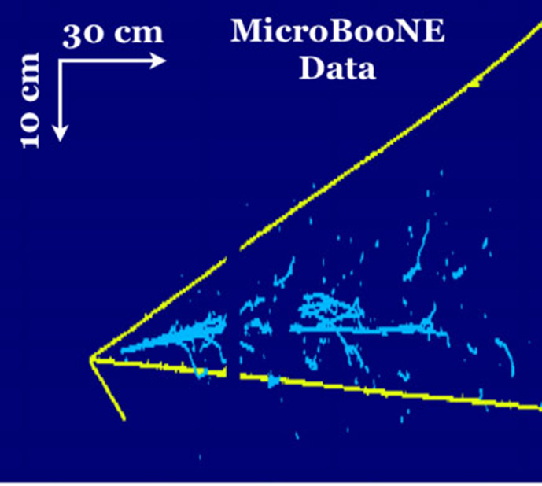

# Advanced Neural Networks

By Corey Adams and edited by Bethany Lusch

Neural Networks are a critical part of modern applications of AI to, well, anything. 

Some overlapping categories of datasets, which influence how people choose a neural network architecture: 
- Tabular
- Image & Video (Computer Vision)
- Text (Natural Language Processing)
- Graph-based
- Geospatial
- Time Series/Sequential
- Audio

Last week, we learned about neural networks with basic "feed-forward" or "dense" layers.  This week's course will focus on applications of neural networks to computer vision, while next week will start getting in to transformers and large language models. In today's session we'll talk about deep convolutional neural networks.  For more than a decade, advancements in computer vision and AI have been driven by networks like the one we'll train today.

For some further reading, here are some resources to see what's happening in machine learning for science.  Most of these papers have some connection to convolutional networks (like we'll cover today) or their generalization Graph Neural Networks (not covered!).

[Machine Learning for Materials Science](https://www.nature.com/articles/s41524-022-00734-6)

[Physics Informed Machine Learning](https://www.nature.com/articles/s42254-021-00314-5)

[Machine Learning and the Physical Sciences](https://journals.aps.org/rmp/abstract/10.1103/RevModPhys.91.045002)

And one image from Corey Adams' line of research, neutrino physics:

Reference: [https://science.osti.gov/hep/Highlights/2019/HEP-2019-01-c](https://science.osti.gov/hep/Highlights/2019/HEP-2019-01-c)

# Today's Content

We will get into the technical details of convolutional neural networks today in notebook [01_conv_networks.ipynb](01_conv_networks.ipynb).  

# Bonus Content
There is a second notebook [02_representation_learning.ipynb](02_representation_learning.ipynb), that does not converge during the time we have for class, showing some basics of applying these techniques in more sophisticated ways.  That notebook is 100% extra material, not part of the mainline course, but if you'd like to learn more about unsupervised training of image models you are welcome to take a look and reach out on Slack.
