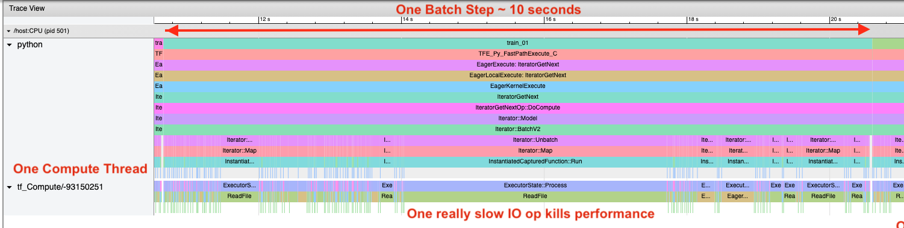

# Building a CPU-side data pipeline

Led by Taylor Childers from ALCF

New AI systems largely depend on CPU-GPU hybrid architectures. This makes efficient use of CPU-side resources important in order to feed sufficient data to the GPU algorithms. Ideally, the CPU processes data and builds training batches, while the GPU performs the compute intensive forward and backward gradient calculations.

Here there are examples of building a data pipeline for both Tensorflow and PyTorch. Tensorflow's data pipeline API is a bit more advanced than PyTorch so we'll focus on that one, though we include an example in PyTorch.

# ImageNet Dataset

This example uses the ImageNet dataset to build training batches.

 

This dataset includes JPEG images and an XML annotation for each file that defines a bounding box for each class. Building a training batch requires pre-processing the images and annotations. In our example, we have created text files that list all the files in the training set and validation set. For each text file, we need to use the input JPEG files and build tensors that include multiple images per training batch.

# Tensorflow Dataset example

Tensorflow has some very nice tools to help us build the pipeline. You'll find the [example here](00_tensorflowDatasetAPI/ilsvrc_dataset.py).

## Build from file list
We'll start in the function `build_dataset_from_filelist`.

1. Open the filelist
```python
# loading full filelist
filelist = []
with open(filelist_filename) as file:
   for line in file:
      filelist.append(line.strip())
```
2. Parse the list of files into a TF Tensor
```python
filelist = tf.data.Dataset.from_tensor_slices(filelist)
```
3. If we are using Horovod for MPI parallelism, we want to "shard" the data across nodes so each node processes unique data
```python
filelist = filelist.shard(config['hvd'].size(), config['hvd'].rank())
```
4. Shuffle our filelist at each epoch barrier
```python
filelist = filelist.shuffle(dc['shuffle_buffer'],reshuffle_each_iteration=dc['reshuffle_each_iteration'])
```
5. Run a custom function on the filelist, which effectively opens the JPEG file, loads the data into a TF Tensor and extracts the class labels. If there are multiple objects in the image, this function will return more than one image using the bounding boxes. `num_parallel_calls` allows this function to run in parallel so many JPEG files can be read into memory and processed in parallel threads.
```python
ds = filelist.map(load_image_label_bb,
                  num_parallel_calls=tf.data.experimental.AUTOTUNE)
```
6. Since the previous map fuction may return one or more images, we need to unbatch the output before we batch it into our fixed batch size
```python
ds = ds.apply(tf.data.Dataset.unbatch)
ds = ds.batch(dc['batch_size'])
```
7. Tell the dataset it can prepare the next batch(es) prior to them being requested
```python
ds = ds.prefetch(buffer_size=tf.data.experimental.AUTOTUNE)
```

Done.

We can now iterate over this dataset in a loop:
```python
for inputs,labels in ds:
   prediction = model(inputs)
   loss = loss_func(prediction,labels)
   # ...
```

## Parallel Processing on ThetaKNL

The example `00_tensorflowDatasetAPI/ilsvrc_dataset_serial.py` can be run via
```bash
# module load miniconda-3/2020-12
python 00_tensorflowDatasetAPI/ilsvrc_dataset_serial.py -c 00_tensorflowDatasetAPI/ilsvrc.json
```

You will see very poor performance as this is an example of serial data pipeline that only uses one or two cores. You can see in this screenshot from the [Tensorflow Profiler](../04_profilingDeepLearning/TensorflowProfiler/) how your processes are being utilized. The profile shows a single process handling all the data pipeline processes. All ReadFile calls are being done serially when they could be done in parallel. One long IO operation holds up the entire application.


Now switch to running the parallel version
```bash
# module load miniconda-3/2020-12
python 00_tensorflowDatasetAPI/ilsvrc_dataset.py -c 00_tensorflowDatasetAPI/ilsvrc.json --interop 64 --intraop 64
```

You will see much better performance in this case. Batch processing time is down from 10 seconds to 1 second. The profiler shows we are running with our 64 parallel processes, all of which are opening JPEGs, processing them into tensors, extracting truth information, and so on. There are still some spurious IO operations that slow us down, but really this speaks to the fact that we are loading a million small files (100KB), which is bad in practice, but good for this example. In reality, we'd want to do all this data processing in advanced.


