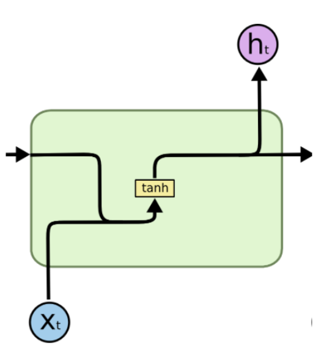

# Time series data

**Types of problems**
- Classification
- Regression 
  - Prediction/Forecasting
- Compression

**Example applications**
- natural language processing
- speech recognition
- traffic forecasting (see Diffusion Convolutional Recurrent Neural Network (DCRNN))
- electrical grid management
- earthquake prediction
- medicine (EEG, outcomes)

**Historically popular models and deep learning architectures**
- Autoregressive (AR, MA, ARMA, ARIMA, ARCH, GARCH)
  - Shumway, Robert H., David S. Stoffer. [Time series analysis and its applications](https://www.stat.pitt.edu/stoffer/tsa4/). Vol. 4. New York: Springer, 2017. 
- MLP
- Recurrent neural network (**this tutorial**)
  - with an Attention layer
- Temporal convolutional network (TCN)

**Successors**:
- Transformers and their variants (GPT, BERT, BART, Reformer, Longformer, ...)
- Vision transformers


## Environment Setup
As a reminder, if you are doing this tutorial on ALCF ThetaGPU, be sure to pull the latest updates to this repo. See our [previous tutorial's instructions](https://github.com/argonne-lcf/ai-science-training-series/blob/main/00_introToAlcf/02_howToSetupEnvironment.md#git-repo) for cloning it, if you havent done so already. From a terminal run the following commands (assuming this repo is cloned with the defualt name in your `$HOME` directory):
```
ssh username@theta.alcf.anl.gov
cd ai-science-training-series
git pull
```


### ALCF JupyterHub

You can run the notebooks of this session on ALCF's JupyterHub. 

1. [Log in to a ThetaGPU compute node via JupyterHub](https://github.com/argonne-lcf/ai-science-training-series/blob/main/00_introToAlcf/04_jupyterNotebooks.md)
(be sure your browser navigates to https://jupyter.alcf.anl.gov/ and does not autocomplete to https://jupyter.alcf.anl.gov/theta/hub/login or another subdomain).

2. Change the notebook's kernel to `conda/2021-09-22` (you may need to change kernel each time you open a notebook for the first time):

    1. select *Kernel* in the menu bar
    1. select *Change kernel...*
    1. select *conda/2021-09-22* from the drop-down menu

3. Open [`CAE_LSTM.ipynb`](./CAE_LSTM.ipynb)

## Vanilla/Simple Recurrent Neural Network (RNN)
All RNN diagrams from Chirstopher Olah's famous 2015 blog post, [Understanding LSTM Networks](https://colah.github.io/posts/2015-08-Understanding-LSTMs/)





(this is technically an Elman RNN, not a Jordan RNN). Train through backpropagation through time (BPTT). Both forward and backward passes can be slow since we cannot compute the time-dependencies in parallel (big advantage of transformers)
- Techniques for handling long or uneven sequences: https://machinelearningmastery.com/handle-long-sequences-long-short-term-memory-recurrent-neural-networks/
- `SimpleRNN` in TF/Keras uses a different formulation. See the source code for [`SimpleRNNCell`](https://github.com/keras-team/keras/blob/v2.7.0/keras/layers/recurrent.py#L1255-L1456)

## Long short-term memory (LSTM)
Introduced by [Hochreiter and Schmidhuber (1997)](https://direct.mit.edu/neco/article-abstract/9/8/1735/6109/Long-Short-Term-Memory?redirectedFrom=fulltext), greatly ameliorates the vanishing/exploding gradient problem that simple RNNs suffer from.


## Gated recurrent unit (GRU)
Introduce by [Cho (2014)](https://arxiv.org/abs/1406.1078), the fully gated version is just an LSTM minus the output gate and has fewer parameters. 


## Example application: predicting anomalies in fusion reactors (tokamaks)
See [Kates-Harbeck (2019)](https://www.nature.com/articles/s41586-019-1116-4) for more details.


