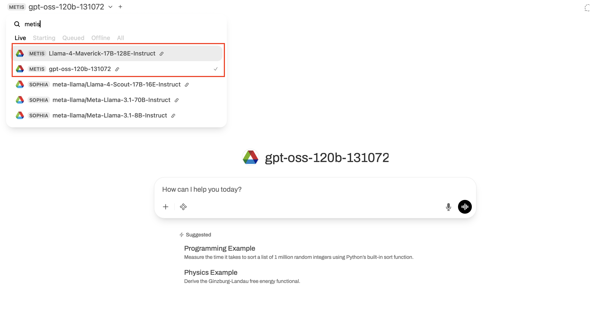

# SambaNova SN40L (Metis)

SambaNova SN40L cluster is  composed of two SambaRacks—each housing 16 Reconfigurable Dataflow Unit (RDU) processors. This dedicated setup delivers high-throughput, low-latency performance for machine learning workloads.

SambaStack is a purpose-built hardware and software platform optimized for AI inference.
Models running on the cluster are exposed through OpenAI-compatible API endpoints, with each endpoint capable of hosting multiple independently accessible models.

## Using Metis Inference Endpoints

The Sambanova SN40L cluster (Metis) is integrated as part of the ALCF inference service provided through API access to the models running on the Metis cluster. The models running on Metis can be accessed in two ways.

1. Web UI
2. API Access
   
The easiest way to get started is through the web interface, accessible at https://inference.alcf.anl.gov/

The UI is based on the popular Open WebUI platform. After logging in with your ANL or ALCF credentials, you can:
1. Select a model from the dropdown menu at the top of the screen.
2. Start a conversation directly in the chat interface.

In the model selection dropdown, you can see the status of each model:

