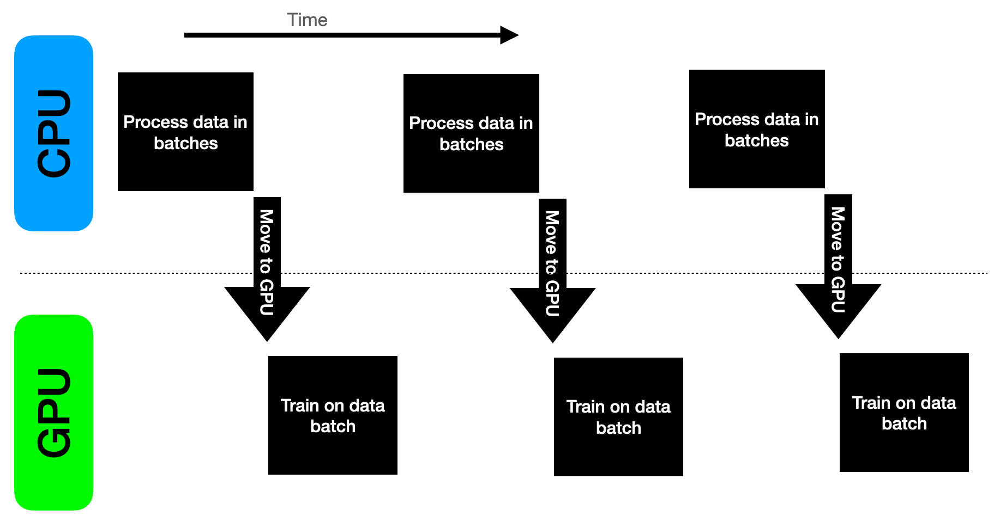
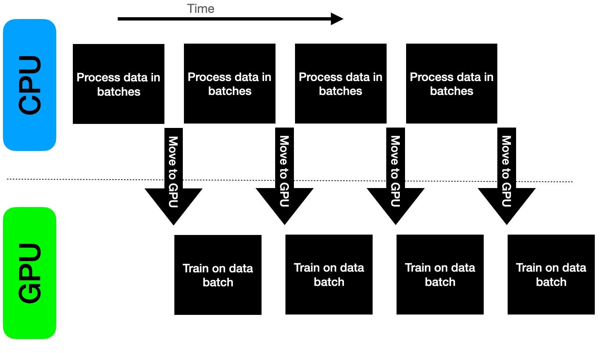
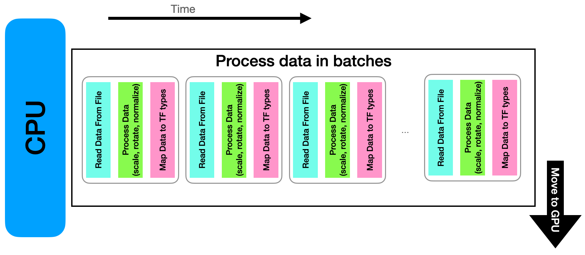
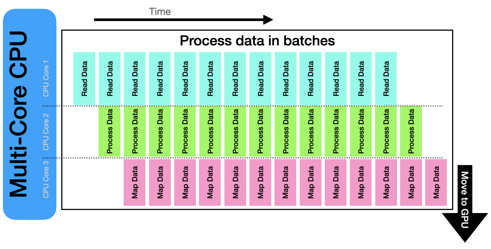
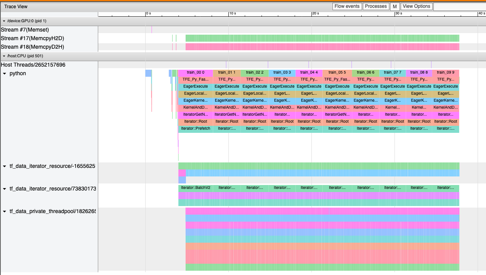
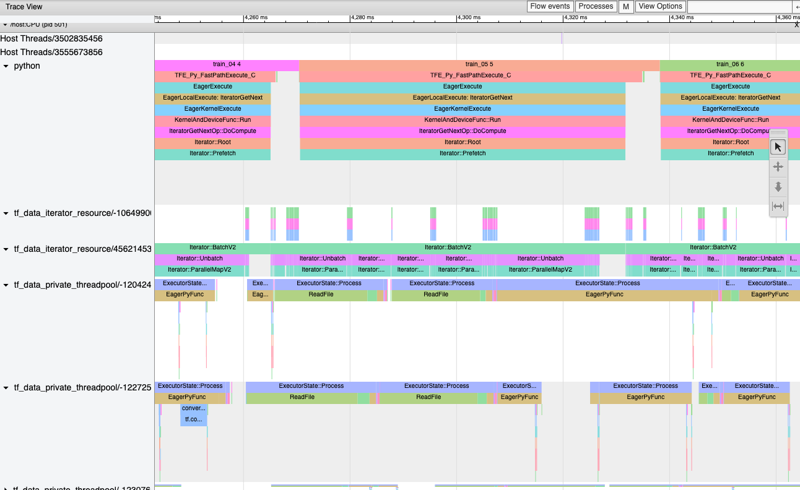

# Building a CPU-side data pipeline
Written by Taylor Childers and Corey Adams from Argonne

## Considering CPU and GPU Usage

Our Polaris supercomputer like many modern systems, contain CPUs and GPUs. Both can be made to do work at the same time, or _concurrently_.

If we look at our workflow, we can see that we have a data processing piece and the model training piece. We can visualize it here:



Notice how the CPU & GPU are busy at different times. In building our data pipeline, we want to impliment it in such a way that overlaps the CPU & GPU activities to keep them busy as much as possible resulting in something like this:



We can also zoom in on the CPU. Our data pipeline may look something like this:



Often your data pipeline will be repeatetive in that each unit of data (in the example below we use JPEG images) must be transformed or processed in similar ways. We load the JPEG, we process the JPEG, then we need to convert it to Tensorflow data types before passing it to our model for training. We perform this pipeline on as many images as we need to compose a single batch for training. Then that batch can be transfered to the GPU's memory for training.

Modern CPUs have many parallel processing units, or cores, each of which can do computational tasks independently or together. Our pipeline is linear in the figure above, and will therefore only utilize 1 CPU core on our Multi-core CPU, leaving much of the chip unused. This is very inefficient and typically also slows us down. Therefore we want our pipeline to be _concurrent_. This means each CPU core has tasks to perform at the same time, more effectively using our resources and speeding up our training time. This can be seen in this image:



Here we see an example 3-core CPU, where we have each core perforing tasks in parallel to speed up the construction of our batch.


## Exercise on Concurrency

Now we will pause to have a group exercise related to concurrency and how it can help speed up our data pipeline.

[Exercise Notebook](ExerciseConcurrency.ipynb)


# Introduction to ImageNet Dataset

We will use the ImageNet dataset in this example to build training batches.

 

This dataset includes JPEG images and an XML annotation for each file that defines a bounding box for each class. Building a training batch requires pre-processing the images and annotations. In our example, we have created text files that list all the files in the training set and validation set. For each text file, we need to use the input JPEG files and build tensors that include multiple images per training batch.

Example XML file:
```xml
<annotation>
	<folder>n02437312</folder>
	<filename>n02437312_10028</filename>
	<source>
		<database>ILSVRC_2012</database>
	</source>
	<size>
		<width>500</width>
		<height>375</height>
		<depth>3</depth>
	</size>
	<segmented>0</segmented>
	<object>
		<name>n02437312</name>
		<pose>Unspecified</pose>
		<truncated>0</truncated>
		<difficult>0</difficult>
		<bndbox>
			<xmin>213</xmin>
			<ymin>127</ymin>
			<xmax>316</xmax>
			<ymax>329</ymax>
		</bndbox>
	</object>
```

# Tensorflow Dataset example

Tensorflow has some very nice tools to help us build the pipeline. We'll step through some of the code from the [example here](ilsvrc_dataset.py) in the following lines.

## Build from file list
We'll start in the function `build_dataset_from_filelist` which processes a list of filenames of JPEGs and turns them into input batches for our ML training loop. This is very similar to our exercise above.

1. Open the filelist
```python
# loading full filelist
filelist = []
with open(filelist_filename) as file:
   for line in file:
      filelist.append(line.strip())
```
2. Parse the list of files into a TF Tensor
```python
filelist = tf.data.Dataset.from_tensor_slices(filelist)
```
3. If we are using Horovod for data-parallel training, we want to "shard" the data across parallel processes so each node processes a different batch. We do not want to send the same data to every parallel training loop or else we are just doing the same thing on all our processes which is a waste. We want each parallel process to look at a different batch and calculate the adjusted model parameters for that batch. The details will be covered in the next session.
```python
filelist = filelist.shard(config['hvd'].size(), config['hvd'].rank())
```
4. Shuffle our filelist at each epoch barrier. We want to randomize our dataset after we train on all of it so that our network doesn't learn only the order in which our data is organized (yes that's a failure mode).
```python
filelist = filelist.shuffle(dc['shuffle_buffer'],reshuffle_each_iteration=dc['reshuffle_each_iteration'])
```
5. Run a custom function on the filelist, which effectively opens the JPEG file, loads the data into a TF Tensor and extracts the class labels. If there are multiple objects in the image, this function will return more than one image using the bounding boxes. `num_parallel_calls` allows this function to run in parallel so many JPEG files can be read into memory and processed in parallel threads.
```python
ds = filelist.map(load_image_label_bb,
                  num_parallel_calls=tf.data.experimental.AUTOTUNE)
```
6. Since the previous map fuction may return one or more images, we need to unbatch the output before we batch it into our fixed batch size
```python
ds = ds.apply(tf.data.Dataset.unbatch)
ds = ds.batch(dc['batch_size'])
```
7. Tell the dataset it can prepare the next batch(es) prior to them being requested
```python
ds = ds.prefetch(buffer_size=tf.data.experimental.AUTOTUNE)
```

Done.

We can now iterate over this dataset in a loop:
```python
for inputs,labels in ds:
   prediction = model(inputs)
   loss = loss_func(prediction,labels)
   # ...
```

## Parallel Processing on Polaris

The example `ilsvrc_dataset.py` can be run via
```bash
qsub -A <project> -q <queue> train_resnet34_polaris.sh
```   

This script will run the example 3 times with 1 thread (no parallelism), 16 threads, and 64 threads per MPI process. The reported `imgs/sec` throughput will be lowest for serial processing and highest for the 64 threads per MPI process. You can see in this screenshot from the [Tensorflow Profiler](https://www.tensorflow.org/tensorboard/tensorboard_profiling_keras) how processes are being utilized. 

This profile shows the single process handling all the data pipeline processes. All data pipeline calls are being done serially when they could be done in parallel. It takes over 3 seconds to prepare a batch of images.


In the case of 64-threads per MPI process, batch processing time is down to 0.08 seconds. The profiler shows we are running with our 64 parallel processes, all of which are opening JPEGs, processing them into tensors, extracting truth information, and so on. Once can see the `ReadFile` operation taking place in parallel which opens the jpeg and reads in the data to memory. This operation is the most time consuming in this pipeline and by parallelizing it, we have improved our throughput.



# Homework

Vary the `parallel_threads` and `prefetch_buffer_size` parameters at the top of [train_resnet34.py](train_resnet34.py) and make a table of how the mean image rate changes.
