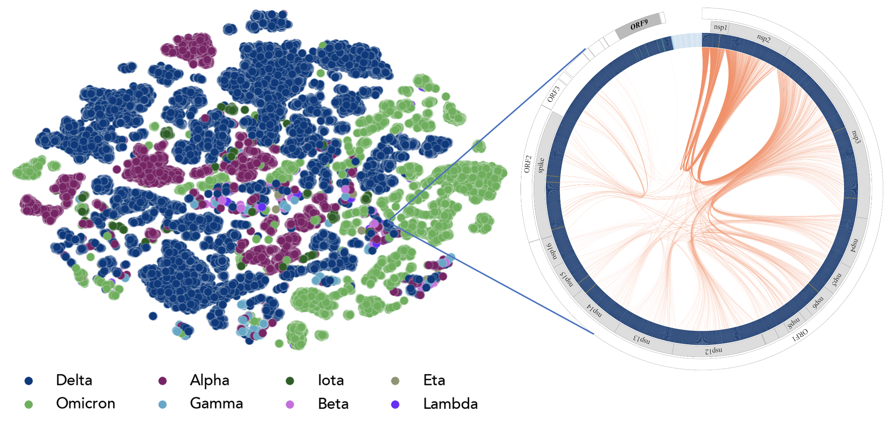

# Introduction to Neural Networks 

Author: Archit Vasan (avasan@anl.gov), including and adapting materials and discussions over time by Varuni Sastri, Carlo Taylor Childers, Venkat Vishwanath, Jay Alammar and Kevin Gimpel.

This tutorial continues the discussion with Carlo Silvastri from last week on large language models (LLMs) where he introduced sequential data modeling, tokenization methods and embeddings.
Here, we will attempt to demystify aspects of the Transformer model architecture.

We will refer to this notebook:

https://github.com/argonne-lcf/ai-science-training-series/blob/architvasan/05_llm_part2/LLM_part02.ipynb

We will discuss:
* positional encodings,
* attention mechanisms,
* output layers,
* and training loops.

This will hopefully also provide the necessary background for next week's discussion of distributed training of LLMs.

We are first going to use "text-generation" using the popular GPT-2 model and the Hugging Face pipeline. Then we are going to code the model elements of a simple LLM from scratch and train this ourselves.

Next week, we'll learn about how to train more complicated LLMs using distributed resources. 


## Environment Setup
1. If you are using ALCF, first log in. From a terminal run the following command:
```
ssh username@polaris.alcf.anl.gov
```

2. Although we already cloned the repo before, you'll want the updated version. To be reminded of the instructions for syncing your fork, click [here](https://github.com/argonne-lcf/ai-science-training-series/blob/main/00_introToAlcf/03_githubHomework.md).

3. We will be downloading data in our Jupyter notebook, which runs on hardware that by default has no Internet access. From the terminal on Polaris, edit the ~/.bash_profile file to have these proxy settings:
```
export HTTP_PROXY="http://proxy-01.pub.alcf.anl.gov:3128"
export HTTPS_PROXY="http://proxy-01.pub.alcf.anl.gov:3128"
export http_proxy="http://proxy-01.pub.alcf.anl.gov:3128"
export https_proxy="http://proxy-01.pub.alcf.anl.gov:3128"
export ftp_proxy="http://proxy-01.pub.alcf.anl.gov:3128"
export no_proxy="admin,polaris-adminvm-01,localhost,*.cm.polaris.alcf.anl.gov,polaris-*,*.polaris.alcf.anl.gov,*.alcf.anl.gov"
```

4. Now that we have the updated notebooks, we can open them. If you are using ALCF JupyterHub or Google Colab, you can be reminded of the steps [here](https://github.com/argonne-lcf/ai-science-training-series/blob/main/01_intro_AI_on_Supercomputer/01_linear_regression_sgd.ipynb). 

5. Reminder: Change the notebook's kernel to `datascience/conda-2023-01-10` (you may need to change kernel each time you open a notebook for the first time):

    1. select *Kernel* in the menu bar
    2. select *Change kernel...*
    3. select *datascience/conda-2023-01-10* from the drop-down menu

## __Exciting example:__

Here is an image of GenSLM described earlier by Arvind Ramanathan. This is a language model that can model genomic information in a single model. It was shown to model the evolution of SARS-COV2 without expensive experiments.


## __References:__

Here are some recommendations for further reading and additional code for review.

* ["The Illustrated Transformer"](https://jalammar.github.io/illustrated-transformer/) by Jay Alammar
* ["Visualizing A Neural Machine Translation Model (Mechanics of Seq2seq Models With Attention)"](https://jalammar.github.io/visualizing-neural-machine-translation-mechanics-of-seq2seq-models-with-attention/) 
* ["The Illustrated GPT-2 (Visualizing Transformer Language Models)"](https://jalammar.github.io/illustrated-gpt2/)
* ["LLM Tutorial Workshop (Argonne National Laboratory)"](https://github.com/brettin/llm_tutorial/tree/main)
* ["LLM Tutorial Workshop Part 2 (Argonne National Laboratory)"](https://github.com/argonne-lcf/llm-workshop)

