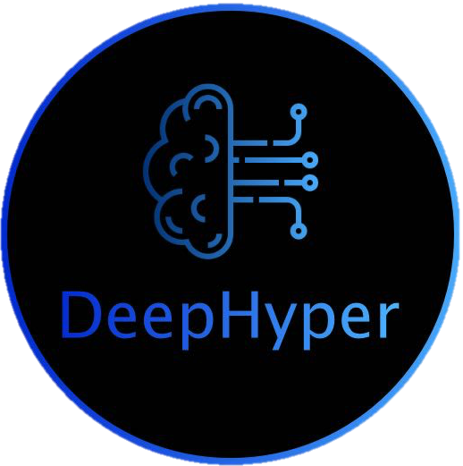
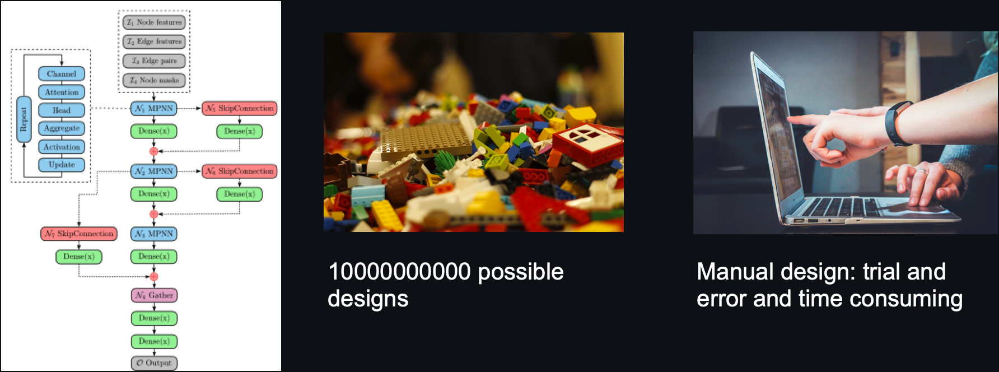
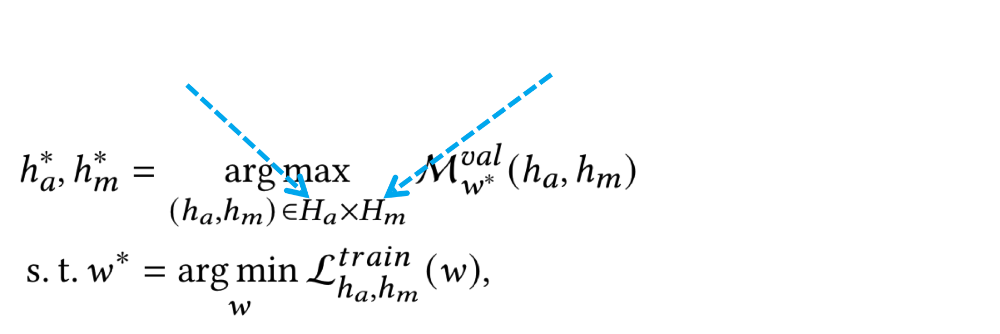
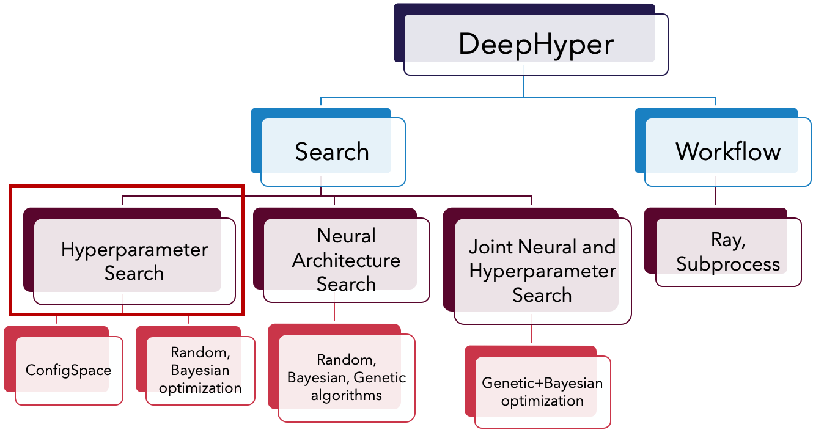
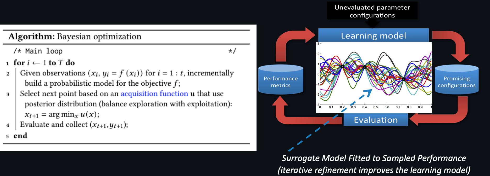
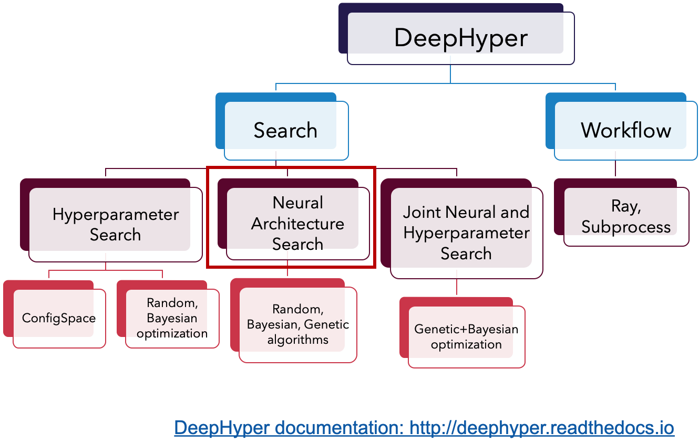
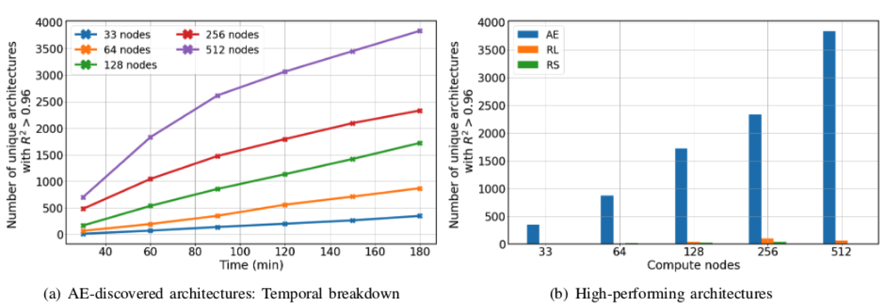
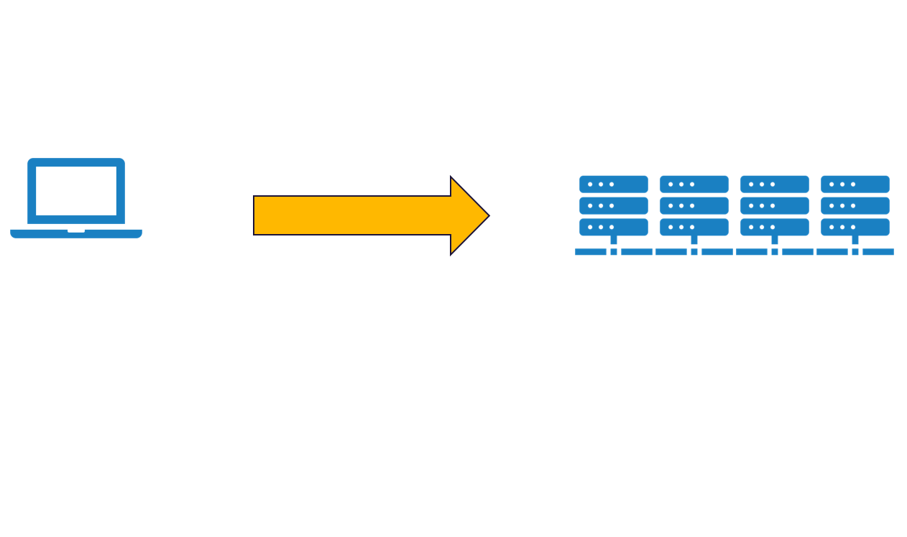
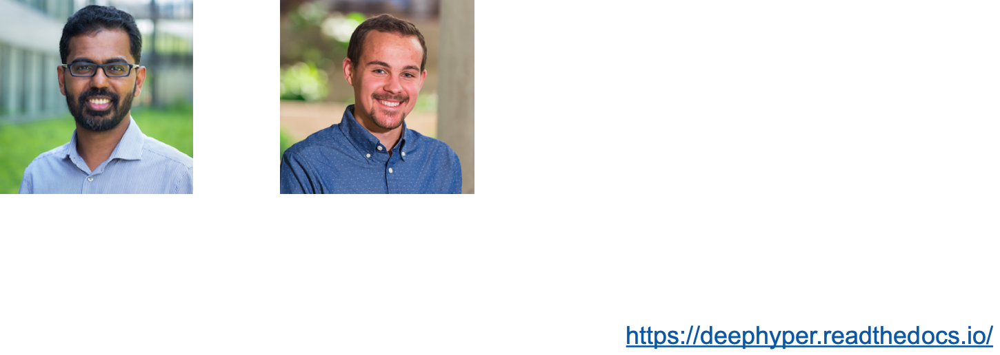
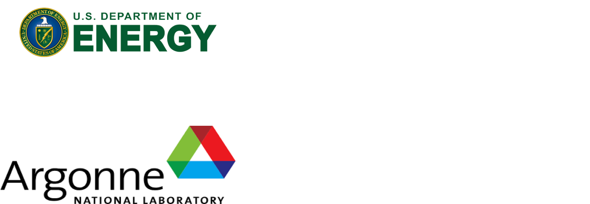

# HyperParameter Search

### with [DeepHyper](https://deephyper.readthedocs.io)

[**Prasanna Balaprakash**](https://www.mcs.anl.gov/~/pbalapra/)
<small style="float;text-align:left;">

Computer Scientist
    
Math & Computer Science Division
    
Leadership Computing Facility
    
Argonne National Laboratory
    
</small>

---
# Degrees of Freedom in Neural Networks Design for Scientific Data

---
# Degrees of Freedom in Neural Networks Design

---

# BiLevel Optimization Problem
 

---

# [DeepHyper](http://deephyper.readthedocs.io) Overview
- Documentation can be found at [deephyper.readthedocs.io](https://deephyper.readthedocs.io)
    

---
# Bayesian Optimization

---
# [DeepHyper](http://deephyper.readthedocs.io) Overview

---
# Configuring Neural Architecture Search

---
# DeepHyper NAS-API

---
# DeepHyper NAS-API

---
# Exploring Search Space
- Regularized ageing evolution to explore the search space of possible architectures

 <!-- .element width="80%" align="center" -->
---
# Searching for a Surrogate LSTM:
## Sea Surface Temperature Forecasting

---
# Scaling
**Single Node, Cluster, Leadership Class**

---
# The DeepHyper Project

> "Automated development of machine learning algorithms to support scientific applications"

---
# DeepHyper Community

---
# References
<small>

- P. Balaprakash, M. Salim, T. Uram, V. Vishwanath, S. M. Wild. DeepHyper: Asynchronous hyperparameter search for deep neural networks. In 18 IEEE 25th international conference on high performance computing (HiPC), 2018.

- P. Balaprakash, R. Egele, M. Salim, S. Wild, V. Vishwanath, F. Xia, T. Brettin, and R. Stevens. Scalable reinforcement-learning-based neural architecture search for cancer deep learning research. In Proceedings of the International Conference for High Performance Computing, Networking, Storage and Analysis, 19.

- R. Maulik, R. Egele, B. Lusch, and P. Balaprakash. Recurrent Neural Network Architecture Search for Geophysical Emulation. In SC ’: IEEE/ACM International Conference on High Performance Computing, Networking, Storage and Analysis, 2020.

- R. Egele, P. Balaprakash, I. Guyon, V. Vishwanath, F. Xia, R. Stevens, Z. Liu.  AgEBO-Tabular: Joint neural architecture and hyperparameter search with autotuned data-parallel training for tabular data. In SC21:  International Conference for High Performance Computing, Networking, Storage and Analysis, (in press), 21.

- R. Egele, R. Maulik, K. Raghavan, P. Balaprakash, B. Lusch. AutoDEUQ: Automated Deep Ensemble with Uncertainty Quantification, (in review), 21.

</small>
---
# Acknowledgements

