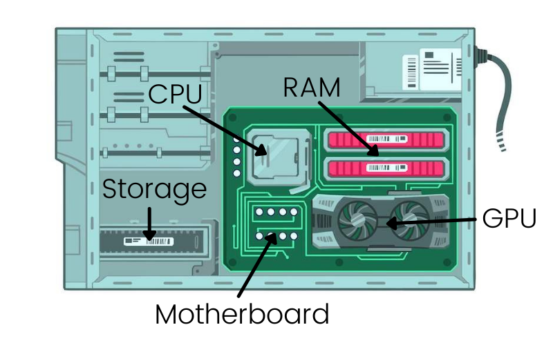
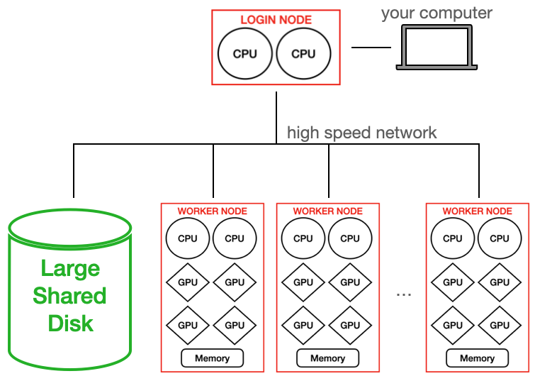
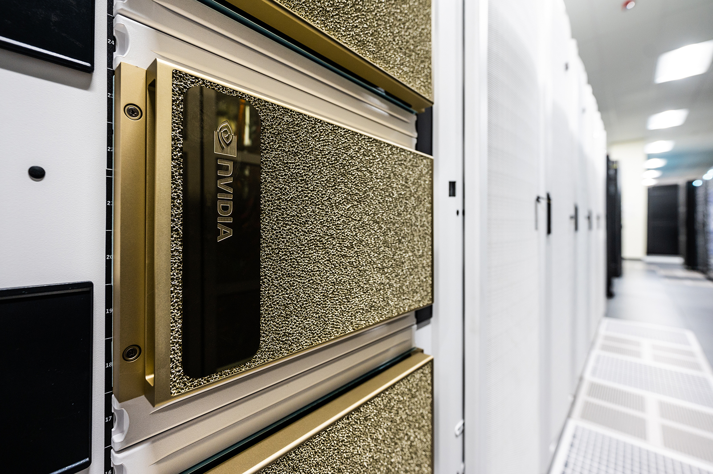
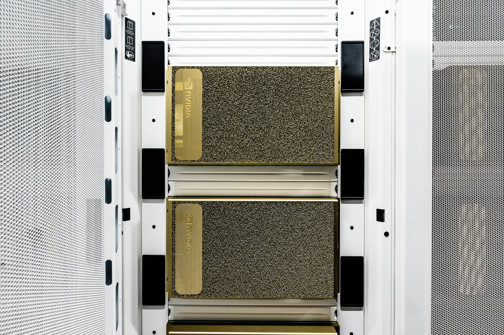
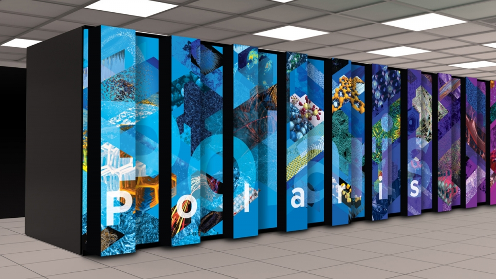

# What is a Supercomputer?

Argonne hosts DOE supercomputers for use by research scientists in need of large computational resources. Supercomputers are composed of many computing _nodes_ (1 _node_ = 1 physical computer) that are connected by a high-speed communications network so that groups of nodes can share information quickly, effectively operating together as a larger computer.

# A Compute Node

If you look inside your Desktop or Laptop you'll find these parts:

A computing node of a supercomputer is very similar, each has simliar parts, but it is designed as a single unit that can be inserted and removed from large closet-sized racks with many others:

In large supercomputers multiple computer processors (CPUs) and/or graphics processors (GPUs) are combined into a single node. It has a CPU on which the local operating system runs. It has local memory for running software. It may have GPUs for doing intensive calculations. Each node has a high-speed network connection that allows it to communicate with other nodes and to a large shared filesystem.

# Cluster/HPC Computing Hardware Setup

Large computer systems typically have _worker_ nodes and _login_ nodes. _login_ nodes are the nodes on which every user arrives when they login to the system. _login_ nodes should not be used for computation, but for compiling code, writing/editing code, and launching _jobs_ on the system. A _job_ is the application that will be launched on the _worker_ nodes of the supercomputer.

# Supercomputers are Big!

These supercomputers occupy a lot of space in the ACLF data center. Here is our staff at the time (2019) in front of [Mira](https://en.wikipedia.org/wiki/Mira_(supercomputer)), an IBM supercomputer, that debuted as the third fastest supercomputer in the world in 2012.

# ALCF Computing System Overview

## [Aurora](https://www.alcf.anl.gov/aurora)

At this time (October 2024), Aurora is being put through its paces with Argonne and Intel working together to prepare the system for scientific researchers. It is amongst the most power supercomputers in thew world, [currently sitting at #2 on the Top500](https://www.top500.org/lists/top500/list/2024/06/). Here you can see one of the many rows of Aurora _nodes_ with their Red & Blue water cooling conduits visible.

In this photo you see a close up of the 16 _nodes_ installed side-by-side. 

## [Sophia](https://www.alcf.anl.gov/sophia)

Inside Sophia, you'll see repetition, though NVidia placed these fancy plates over the hardware so you only see their logo. However, each plate covers 1 computer _node_.

 Sophia Racks | Sophia Inside
 --- | ---
 | 

Sophia is an NVIDIA DGX A100-based system. The DGX A100 comprises eight NVIDIA A100 GPUs that provide a total of 320 gigabytes of memory for training AI datasets, as well as high-speed NVIDIA Mellanox ConnectX-6 network interfaces.

Sophia Machine Specs
* Speed: 3.9 petaflops
* Each Node has:
  * 8 NVIDIA (A100) GPUs each with 40GB onboard memory
  * 2 AMD EPYC (7742) CPUs
  * 1 TB DDR4 Memory
* 24 Total Nodes installed in 7 Racks

## [Polaris](https://www.alcf.anl.gov/polaris)

The inside of Polaris again shows the _nodes_ stacked up in a closet.

Polaris is an NVIDIA A100-based system.

Polaris Machine Specs
* Speed: 44 petaflops
* Each Node has:
  * 4 NVIDIA (A100) GPUs
  * 1 AMD EPYC (Milan) CPUs
* ~560 Total Nodes

[NEXT ->](./01_sharedResources.md)
