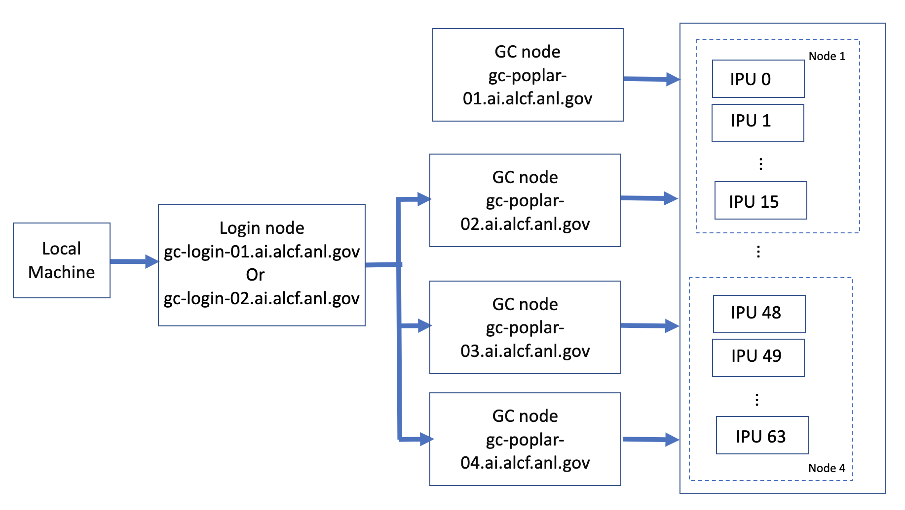

# Graphcore 

## Connection to Graphcore 



Login to the Graphcore login node from your local machine.
Once you are on the login node, ssh to one of the Graphcore nodes.

```bash
local > ssh ALCFUserID@gc-login-01.ai.alcf.anl.gov
# or
local > ssh ALCFUserID@gc-login-02.ai.alcf.anl.gov
```
```bash
login-01.ai.aclf.anl.gov > ssh gc-poplar-02.ai.alcf.anl.gov
# or
login-01.ai.aclf.anl.gov > ssh gc-poplar-03.ai.alcf.anl.gov
# or
login-01.ai.aclf.anl.gov > ssh gc-poplar-04.ai.alcf.anl.gov
```

## Prerequisite: Create Virtual Environment 

### PyTorch virtual environment

```bash
mkdir -p ~/venvs/graphcore
virtualenv ~/venvs/graphcore/poptorch33_env
source ~/venvs/graphcore/poptorch33_env/bin/activate

POPLAR_SDK_ROOT=/software/graphcore/poplar_sdk/3.3.0
export POPLAR_SDK_ROOT=$POPLAR_SDK_ROOT
pip install $POPLAR_SDK_ROOT/poptorch-3.3.0+113432_960e9c294b_ubuntu_20_04-cp38-cp38-linux_x86_64.whl
```


## Miscellaneous Environment Variables
```bash
mkdir ~/tmp
export TF_POPLAR_FLAGS=--executable_cache_path=~/tmp
export POPTORCH_CACHE_DIR=~/tmp

export POPART_LOG_LEVEL=WARN
export POPLAR_LOG_LEVEL=WARN
export POPLIBS_LOG_LEVEL=WARN

export PYTHONPATH=/software/graphcore/poplar_sdk/3.3.0/poplar-ubuntu_20_04-3.3.0+7857-b67b751185/python:$PYTHONPATH
```
## Clone Graphcore Examples

We use examples from [Graphcore Examples repository](https://github.com/graphcore/examples) for this hands-on. 
Clone the Graphcore Examples repository.
```bash
mkdir ~/graphcore
cd ~/graphcore
git clone https://github.com/graphcore/examples.git
cd examples
git tag
git checkout v3.3.0
```

## Job Queuing and Submission

ALCF's Graphcore POD64 system uses Slurm for job submission and queueing. Below are some of the important commands for using Slurm.

* `srun` : The Slurm command `srun` can be used to run individual Python scripts. Use the --ipus= option to specify the number of IPUs required for the run.
e.g. `srun --ipus=1 python mnist_poptorch.py`
* `sbatch` : The jobs can be submitted to the Slurm workload manager through a batch script by using the `sbatch` command
* `squeue` : command provides information about jobs located in the Slurm scheduling queue.
* `sCancel` : is used to signal or cancel jobs, job arrays, or job steps.

## Hands-on Example

* [GPT2](./gpt2.md)
> Note: Precompiled artifacts are present at the `/software/graphcore/projects/models_compile` location for the above models.
copy them to your `~/tmp` and set `export POPTORCH_CACHE_DIR=~/tmp` to skip the compile process.

## Homework

Run [MNIST example](./mnist.md) by changing values of the input parameters like batch-size, learning rate and number of epochs trained and observe and report the performance implications. Submit proof (contents printed out to your terminal, path to a logfile or screenshot) that you were able to successfully follow the instructions and execute.

## Additional Examples (Optional)

* [MNIST](./mnist.md)
* [BERT](./bert.md)


## Profiling (Optional) 

We will use Pop Vision Graph Analyzer and System Analyzer to produce profiles. 

* [PopVision Graph Analyzer User Guide](https://docs.graphcore.ai/projects/graph-analyser-userguide/en/latest/)
* [PopVision System Analyzer User Guide](https://docs.graphcore.ai/projects/system-analyser-userguide/en/latest/)
* [PopVision Tools Downloads](https://www.graphcore.ai/developer/popvision-tools#downloads) 

#### PopVision Graph Analyzer

To generate a profile for PopVision Graph Analyzer, run the executable with the following prefix

```bash
$ POPLAR_ENGINE_OPTIONS='{"autoReport.all":"true", "autoReport.directory":"./graph_profile", "profiler.includeFlopEstimates": "true"}' python mnist_poptorch.py
```

This will generate all the graph profiling reports along with flops estimates and save the output to the graph_profile directory.

To visualize the profiles, download generated profiles to a local machine and open them using PopVision Graph Analyzer. 

#### PopVision System Analyzer

To generate a profile for PopVision System Analyzer, run the executable with the following prefix

```bash
$ PVTI_OPTIONS='{"enable":"true", "directory": "./system_profile"}' python mnist_poptorch.py
```
This will generate all the system profiling reports and save the output to system_profile directory.

To visualize the profiles, download generated profiles to a local machine and open them using PopVision Graph Analyzer. 

## Useful Resources 

* [ALCF Graphcore Documentation](https://docs.alcf.anl.gov/ai-testbed/graphcore/system-overview/)
* [Graphcore Documentation](https://docs.graphcore.ai/en/latest/)
* [Graphcore Examples Repository](https://github.com/graphcore/examples)
* Graphcore SDK Path: `/software/graphcore/poplar_sdk`
